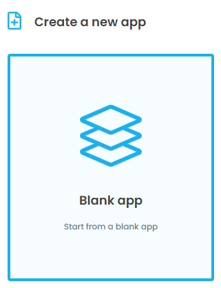
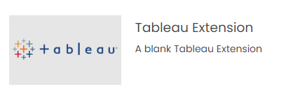
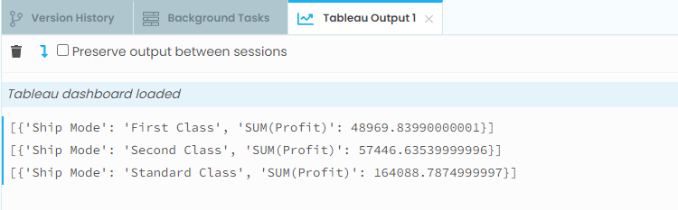

Getting Started
---------

Let's build a simple extension that displays the summary data from Tableau within Anvil when a user clicks a bar in a bar chart.

First create a new extension in Anvil by selecting "Blank app" and then "Tableau Extension":

Download and add a trex file to Tableau
=====

In order to add an extension built in Anvil to Tableau it needs to be added to the dashboard using a `.trex` file. The trex file is first downloaded from Anvil and then uploaded to Tableau.

In Anvil:

1. Click the green "Test in Tableau" button in the top right.
2. A popup will appear, click "Click here to download the manifest file for your extension", the trex file should appear in your downloads.

In Tableau:

4. Go to the dashboard, drag and drop the "Extension" object wherever you'd like.
5. In the bottom left of the alert that appears, select "Access Local Extensions" and locate the `.trex` file from step 2.

.. dropdown::
    :open:

    .. image:: media/download_trex.gif

Write some code
=====

Now that our Anvil app is connected to our dashboard, we'll need to modify the code.

- Rename ``Form1`` to ``MainForm``
- Add a label to the UI and change its Python name to ``label_1``
- Paste the following in the code section of the initial Anvil form

.. code-block:: python
    :linenos:

    # client_code/MainForm/__init__.py
    from ._anvil_designer import MainFormTemplate
    from anvil import *
    from tableau_extension.api import get_dashboard

    class MainForm(MainFormTemplate):
        def __init__(self, **properties):
            self.init_components(**properties)
            self.dashboard = get_dashboard()
            self.dashboard.register_event_handler('selection_changed', self.show_selections)

        def show_selections(self, event):
            print(event.worksheet.selected_records)
            self.label_1.text = str(event.worksheet.selected_records)

In the form code above, we do 2 important things:

1. Get the current Tableau dashboard using :obj:`~client_code.api.get_dashboard`. :obj:`~client_code.api.get_dashboard` returns a :obj:`~client_code.model.proxies.Dashboard` object and contains many useful attributes and methods such as datasources, filters, parameters, and worksheets.

2. Bind the ``show_selections`` method of our Anvil form to the ``selection_changed`` event of the Tableau dashboard using ``register_event_handler``. The ``selection_changed`` event is triggered from Tableau whenever the user selects / unselects marks, and every time this event is triggered the ``show_selections`` method is executed.

.. dropdown:: Congrats, you now have a working Tableau extension!
    :open:

    .. image:: media/firstexample.gif

Additionally, output from the ``print`` statement also appears in the Anvil IDE:

.. button-link:: https://anvil.works/build#clone:UZAM5LB6X3KTWC6G=LRO6QQ5553FPXKPB7VBR55MP
   :color: primary
   :shadow:

   Click here to clone the Anvil App

And :download:`here <media/getting_started_workbook.twb>` for the Tableau workbook
