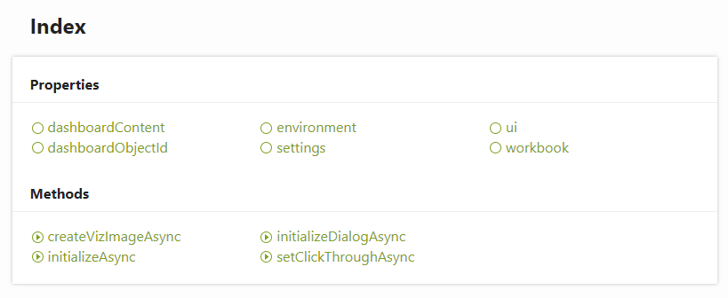

Accessing the JavaScript API
----

If there are methods or objects you'd like to use that are not implemented in the Python wrapper, the entire JS API can be accessed directly from the ``tableau`` module. Documentation for the Tableau JS API can be found `here <https://tableau.github.io/extensions-api/>`_.

For a more in depth conversation around accessing JS objects from Anvil, see the `Anvil documentation <https://anvil.works/docs/client/javascript#using-javascript>`_.

To get a taste of what's available, let's take a look at the attributes of ``tableau.extensions``.

.. code-block:: python

    # This import will be automatically added to your code in Anvil when you create a 
    # new Tableau Extension
    >>> from anvil import tableau
    >>> obs = [x for x in dir(tableau.extensions) if not x.startswith('_')]
    >>> print(obs)

    ['constructor', 'createVizImageAsync', 'dashboardContent', 'dashboardObjectId', 'environment', 
    'extensionImpl', 'get', 'initializeAsync', 'initializeDialogAsync', 'keys', 'setClickThroughAsync', 
    'settings', 'ui', 'workbook']

The corresponding Tableau extension documentation (`see here <https://tableau.github.io/extensions-api/docs/interfaces/extensions.html>`_) lists the following:

   
Note that the properties and method names in the above image are also included in ``dir(tableau.extensions)``, and these methods can be called from within Python. For example, taking a look at ``dashboardContent`` returns:

.. code-block:: python

    >>> from anvil import tableau
    >>> print(tableau.extensions.dashboardContent.dashboard.objects)
    
    [<e (native JS) proxyobject>, <e (native JS) proxyobject>, <e (native JS) proxyobject>, 
    <e (native JS) proxyobject>, <e (native JS) proxyobject>, <e (native JS) proxyobject>, 
    <e (native JS) proxyobject>, <e (native JS) proxyobject>, <e (native JS) proxyobject>]
    
These ``proxyobject`` can be interacted with in Python, usually by accessing their attributes by name. For example, according to `the documentation <https://tableau.github.io/extensions-api/docs/interfaces/dashboard.html#objects>`_, ``dashboard.objects`` is an Array of ``DashboardObject``. Each of these objects has properties such as ``name``, ``type``, and ``isVisible``. Let's see what happens when I try to access these properties from Python.

.. note:: 
    
    The autocompleter in Anvil will help you out even when navigating through the underlying methods of the ``tableau`` module from ``anvil``.

.. code-block:: python

    >>> from anvil import tableau
    >>> objs = tableau.extensions.dashboardContent.dashboard.objects
    >>> for x in objs:
    ...     print(f'name: {x.name}, type: {x.type}, isVisible: {x.isVisible}')

    name: Viz, type: worksheet, isVisible: True
    name: Tiled, type: blank, isVisible: True
    name: Underlying Data Demo, type: extension, isVisible: True
    name: Tiled, type: blank, isVisible: True
    name: Vertical, type: blank, isVisible: True
    name: Horizontal, type: blank, isVisible: True
    name: Ship Mode, type: quick-filter, isVisible: True

Nice! Even though I got a list of proxy objects, I am still able to access their properties and even methods using Python code. If you're looking for further use of the underlying JS api, the :doc:`popup/popup` guide demonstrates displaying a popup window inside Tableau.
