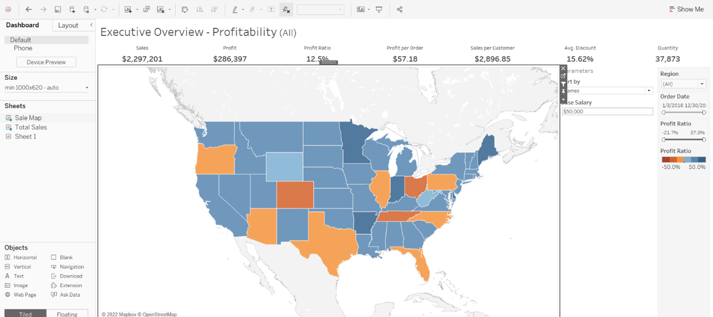
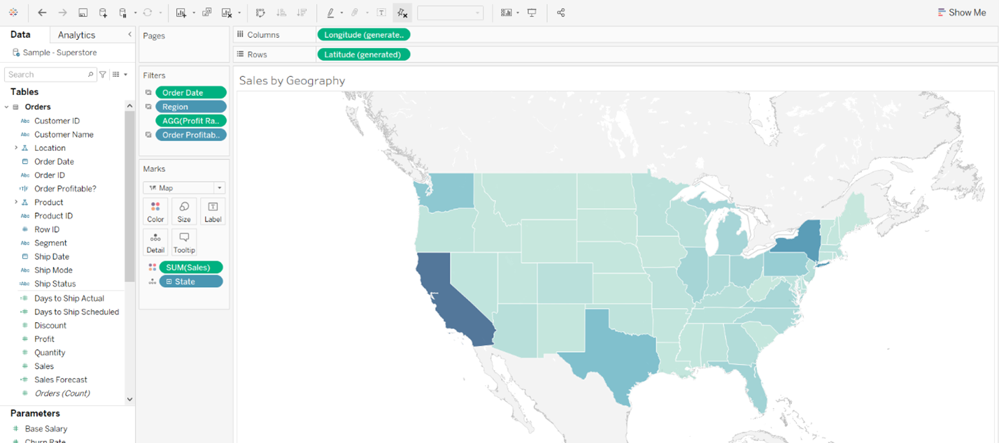

How to create a Tableau dashboard
===================================

Creating a dashboard with Tableau, an interactive data visualization tool to help people see and understand data.

.. raw:: html

    <h2>Chapter 2: Build your Tableau dashboard</h2>

Let’s create a Tableau dashboard that we can use to select marks and easily figure out which comments are pointed towards which marks of the dashboard.

Step 1: Create a Tableau dashboard 
~~~~~~~~~~~~~~~~~~~~~~~~~~~~

To follow along with this section you will need to know the basics of how to create and use Tableau worksheets and dashboards. 
If you’re brand new to Tableau, `Tableau’s Desktop Tutorial <https://help.tableau.com/current/guides/get-started-tutorial/en-us/get-started-tutorial-home.htm>`_ has sections which will teach you everything you need to connect your data and make visualizations that are relevant to your company’s goals.

For this tutorial, I have included an example dashboard that you may use to get familiar with Tableau and see the potential use-cases:

Step 2: Customize the Tableau Dashboard
~~~~~~~~~~~~~~~~~~~~~~~~~~~~

Tableau has a number of marks, filters and parameters that you can edit to personalize your sheets and dashboards. We are going to change the title to our company name and color-code the map to make the marks (States) color coded by sales, with dark being higher sales.

To change the title of our dashboard, double click on the top-left where the current title is. Enter your company name and hit OK.

To change the colors for our dashboard, we must change it first at the sheet. In the bottom left you can see that we are currently on the Overview dashboard, now switch over to Sale Map sheet. 

Now that we are in Sale Map, we can change this sheet. On the left side of the screen there are variables, quantitative in green, categorical in blue. We are going to want to color the states with higher sales a darker color, so let’s drag the quantitative variable ‘Sales’ over the ‘Color’ box in the Marks section.

That’s it, we now have a Tableau dashboard ready to use alongside our Anvil app. Next up, let’s get our Tableau dashboard’s API credentials that we need to authenticate our API calls.

In Chapter 3, we’ll begin sending the details of your actions in Tableau using the Tableau API.
