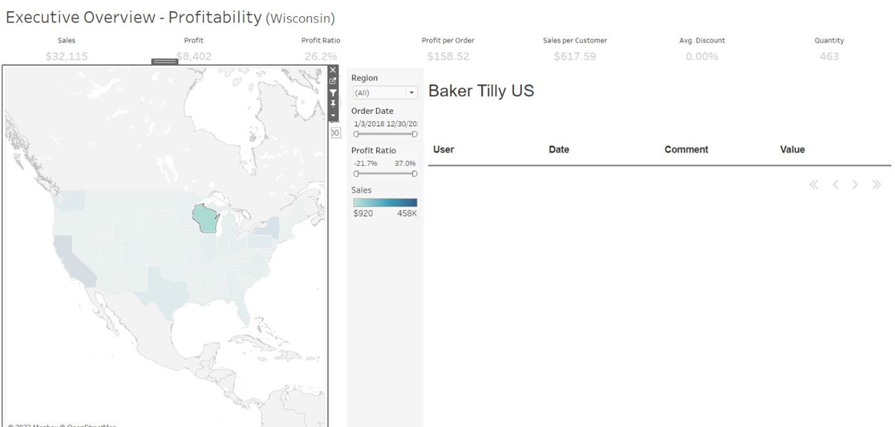
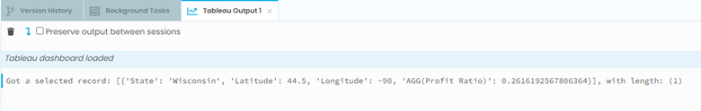
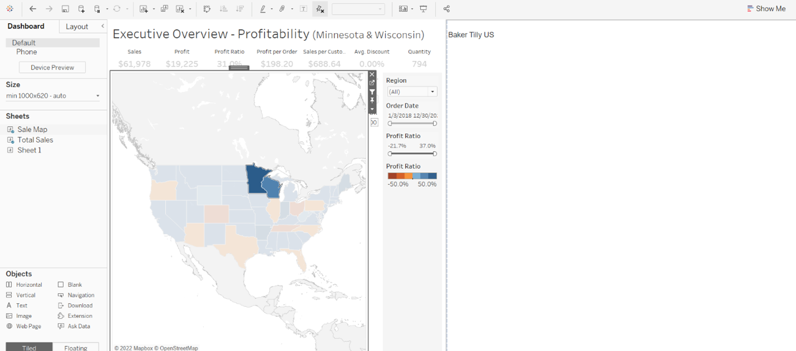
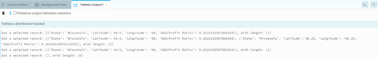

Chapter 4: Creating the Event Handler
===================================

Event handlers are useful for relaying what are doing in the Tableau Dashboard and communicating with our Anvil app.

We will be using the selection changed event handler to let our app know when we select/un-select marks in the Tableau dashboard.

Step 1: Creating the Event Handler
~~~~~~~~~~~~~~~~~~~~~~~~~~~~~~~~~

Let’s start by writing a method in our Form that will catch events and print the information to the console. An ‘event handler’ is a function that is called whenever an event occurs, for example, when the user makes a selection on the dashboard. It should always accept an ‘event’ argument.

Events usually come with some information about how they were triggered. For example, ‘selection_changed’ events are always associated with a worksheet. For now, let’s just print the following statement so we can see how the selection appears in Python:

.. code-block:: python

    def selection_changed_event_handler(self, event):
        user_selection = event.worksheet.selected_records
        print(f"Got a selected record: {user_selection}, with length: ({len(user_selection)})")

Once we get this event handler registered, upon selecting a mark in our Tableau dashboard, the session logger will print the information on the selected marks as well as how many marks we selected to the app Logs. More on this next.

Step 2: Registering the Event Handler with the Tableau Dashboard Extension API
~~~~~~~~~~~~~~~~~~~~~~~

For our event handler to be of any use, it must be registered with our live instance of Tableau dashboard and worksheets.

Let’s register the event handler in Form1 by adding the bottom 2 lines of code to our form. We put these lines in the special __init__ method because this automatically runs when the form initializes.

Note: I deleted the line of code that we used before to print “Hello World!”. As cool as that was, it is no longer needed.

.. code-block:: python

    def __init__(self, **properties):
        # Set Form properties and Data Bindings.
        self.init_components(**properties)

        # Any code you write here will run when the form opens.
        dashboard.register_event_handler('selection_changed', self.selection_changed_event_handler)

The method **register_event_handler** has 2 important arguments:

1.	Which type of event we want to be able to catch

2.	The name of the method that will catch the event

More on event handlers and listeners `here. <https://tableau.github.io/extensions-api/docs/trex_events.html>`_ 

Step 3: Testing out the Event Handler
~~~~~~~~~~~~~~~~~~~~~~~~~~~~~~~~~~~

Now that our event handler is registered, we want to ensure that our Anvil form and Tableau Dashboard are properly working and be able to see what is getting printed to the console, right? 

First, we must refresh our Anvil application in the Tableau dashboard to reflect the changes we have made. You must do this every time you make changes to your forms to ensure you are running on the most up-to-date version of your app. 

Go back to your Tableau dashboard and click on your Anvil app extension. As we did in Chapter 3, in the top left you should see a carat for More Options. Click on that and press Reload.  

Now that the application is updated, let’s test out our new changes.

Start by clicking on any mark on the map. (I chose Wisconsin because I grew up there)

Your screen probably looks like this, and no changes have been made to the Dashboard itself.

Why is that? It is because we are currently only asking our event handler to send information on the selected records as well as the length (# of total) selected records.

As you ‘print’ statements in an Anvil extension, these print statement stream real-time to the Tableau Output pane:

In cases of errors and bugs, this will link directly to the line that caused the problem. These tools are very effective for debugging and development purposes, but will be hidden from your end-users.

Hooray! We got our data to print to the console for viewing. Our data comes in the form of a list of dictionaries, with keys representing the Tableau dimensions and measures, and the values as the associated value (which can be text, a number, a date, etc.).

Let’s see what happens if we select 2 marks at the same time in Tableau. Open up Tableau and press control while clicking on another mark. (I chose Minnesota since it is our little brother state)

Un-select both marks and go back to the Tableau Output. 
You should now see that the logger printed information on both Wisconsin and Minnesota (the selected record with length of 2), the most recent record printed is an empty list with length 0.

Good work! You have successfully set up a 2-way conversation between your Anvil app and your Tableau dashboard.

In Chapter 5 we will walk through how to create a data grid that will allow our comments data to appear on the screen.