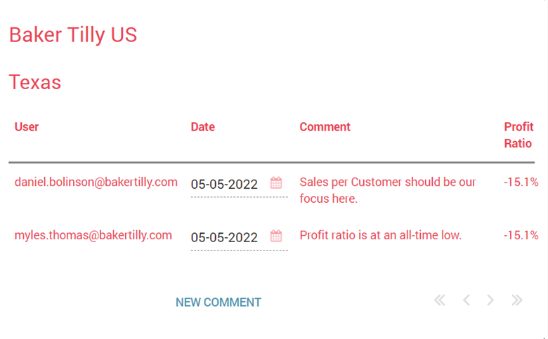
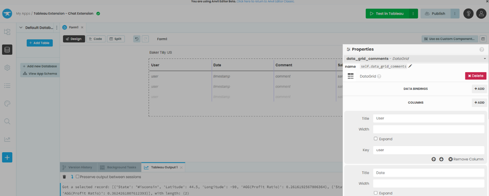
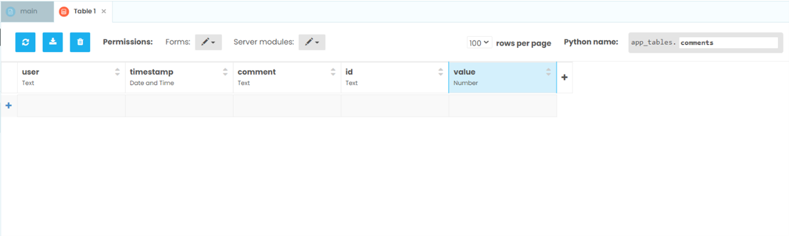
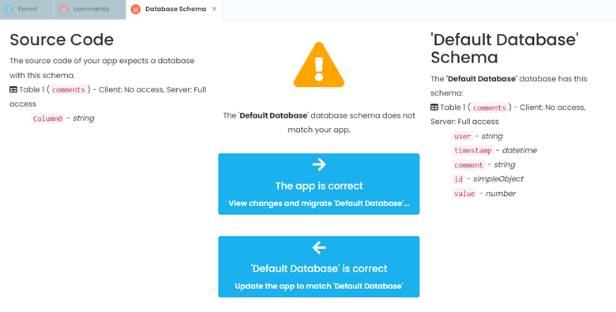

Chapter 5: Adding a data grid to view chatter
===============================================

We have set up a Form and an event handler that will eventually view comments made for each mark, but we have no way of viewing the comments. This changes now. 

Let’s start by going to our Anvil form and opening the toolbox.

Step 1: Creating a comments interface form 
~~~~~~~~~~~~~~~~~~~~~~~~~~~~~~~~~~~

Let’s add a data grid into our form.

This data grid will contain all our team’s comments and should end up looking like this:

Drag and drop a data grid under the blank label and change its Python name to something more descriptive, such as **data_grid_comments**. This is the table that will hold the information for our team’s chatter. 

In properties, add a new column, and change the column names and keys to the following: 

•	User: user

•	Date: timestamp

•	Comment: comment

•	Sales: value

Data grids need data to populate, and here is where the Anvil data tables comes in handy. On the left hand side, click on the ‘Data’ pane and select ‘Add Table’. Rename the Python name as comments and create the following columns with their respective data types:

•	user (Text)

•	timestamp (Date and Time)

•	comment (Text)

•	id (Text)

•	value (Number)

Before finishing, make sure to change the permissions to ‘Can search, edit and delete’ for both Forms and **Server modules**.

Also, you may encounter this error/notification, which you will want to select ‘Default database is correct’ to verify the changes we just made.

That’s it, we’ve created an interface for users to view comments made.

In Chapter 6 we will walk through how to create and open a form that will allow our chat extension to create comments.

