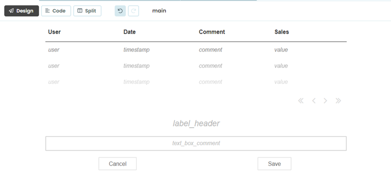
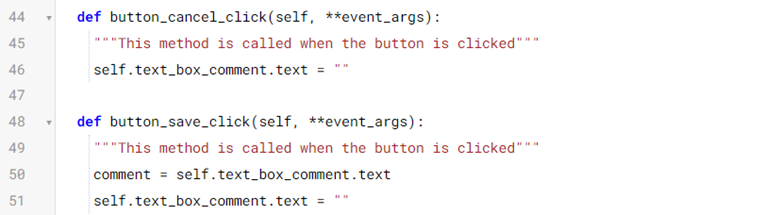
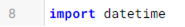
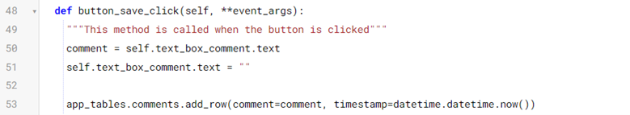
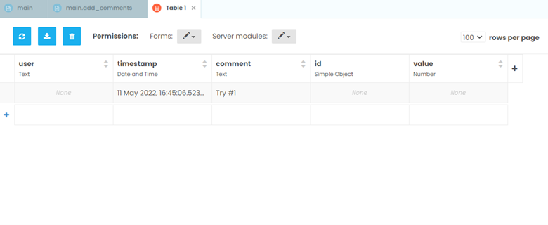

How to create a form to add new comments
===========================================

We have set up an interface to view comments and an event handler that will eventually view comments made for each mark, but we have no comments in our database! This changes now.

.. raw:: html

    <h2>Chapter 6: Creating an Interface to Add New Comments</h2>

Let’s start by adding to our form. We are going to accept user’s input in our dashboard!

Step 1: Add tools and create an interface to make new comments
~~~~~~~~~~~~~~~~~~~~~~~~~~

Let’s get out the toolbox for this one. Using the toolbox on the right-hand side, add in the following tools with the following properties:

•	A Label named label_header (text: font size 20 and center)

•	A TextBox named text_box_comment (text: center)

•	A Button named button_cancel (label: “Cancel”)

•	A Button named button_save (label: “Save”)

Reminder: The “name” of the component is the Python name that represents that object as an attribute of your Form.

It should look something like this:

Step 2: Adding functionality
~~~~~~~~~~~~~~~~~~~~

We now have set our form up to be able to save comments, but when we click our cancel and save buttons, they don’t do anything. Time to add in event methods to do our desired tasks: Delete the comment if the cancel button is clicked or save the comment to the database if the save button is clicked. 

So, we want to add two event handlers for our two buttons (simply double-clicking the buttons will do most of the work for us):

In the cancel button method, that function will clear out the comment currently written.

In the save button method, we want to keep the comment the user made so we clear out the text box and save text the user entered in the textbox as a variable:

Step 3. Saving the comment to a Data Table
~~~~~~~~~~~~~~~~~~~~~

Now, we want to save our comment so that our colleagues can see it. We are going to also want to time-stamp it, so first we need to import datetime at the top of the form, with our other imports.

Because we made our Data Table editable by the client (back in Step 2), we can use Anvil’s Tables to write back to our data table with a single line of code:

Head back, reload your extension, and save your first comment!

Everything is good now, right? Wrong.

On the left-hand side open the Data screen and look at the **comments** table. As you can see, our comment was inserted, but we don’t know who made the comment, which mark it identifies with, or the value of interest. (In our case, this is Sales)

In chapter 7 we will learn how to improve our event handler by grabbing the selected record and associating it with the comment.