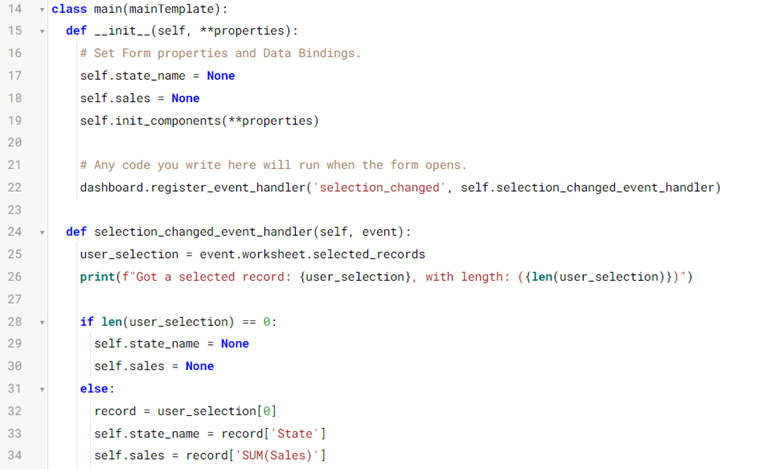
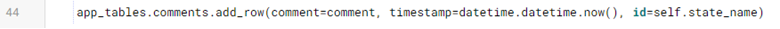

How to improve your event handler
===================================

We have successfully created an event handler that logs information to the console. Let’s build on that by decking out our event handler to further interact with our Anvil app.

.. raw:: html

    <h2>Chapter 7: Making the Event Handler useful</h2>

Our goal now is to have our event handler know which mark(s) are selected so that it can tell our Anvil app which marks are being selected and eventually what data to put on the screen.

Step 1: Add functionality to the Event 
~~~~~~~~~~~~~~~~~~~~~~~~~~

Now that we can access state, let’s have state updated every time we click on a mark in the Tableau dashboard.

Note that we’ll take the first (0th index) state that was selected; this will work great if a user selects a single state. If a user selects more than one, we’ll just take the first and record the comment associated with that; you could to more with the full selection, but we’ll keep it simple for now.

We also need to handle the instance when the user unselects on the dashboard; in this case, there will be no marks selected, so we will handle that by clearing our selection.

So heading back to main, we’ll add some more logic to our **selection_changed_event_handler**. Because we want to ‘remember’ the selection to associate these with comments later, we make them attributes of our form. When you do that, it’s always a good idea to set a default value in your init:

This looks like a lot of code, but it really is simple.

•	If 0 marks are selected, we reset the selected state name to empty (None).

•	Otherwise, we take the first state and record the total Sales and the state name. (If you are using your own dashboard, then you’ll have to decide what identifier and value you want to use, but any identifier and value will work. Your print(user_selection) will help a lot in figuring out what to use!)

Now we know which State has been selected, we have added that to our form as an attribute. Adding that to our Comment is as simple as adding the identifiers to our add_row call:

In chapter 8 we will put the finishing touches on the application so that our chat extension is ready to go!

