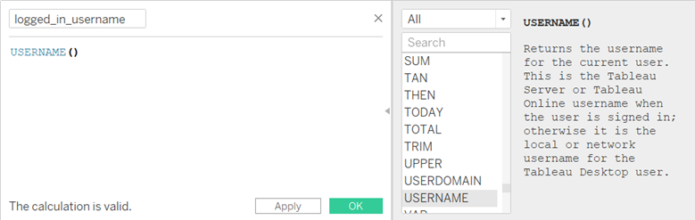
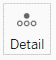
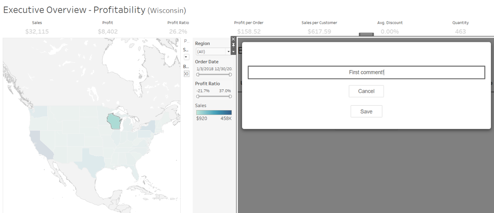
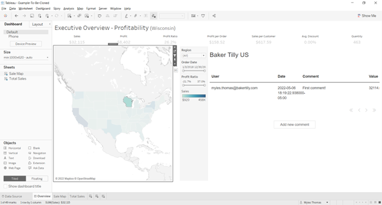
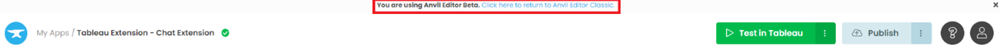
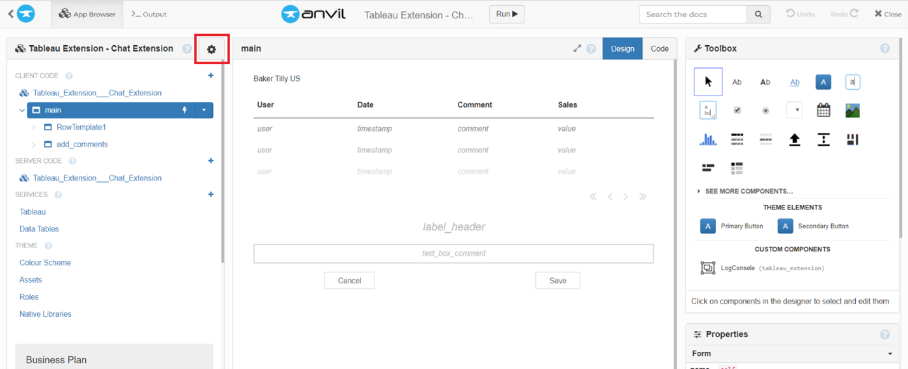
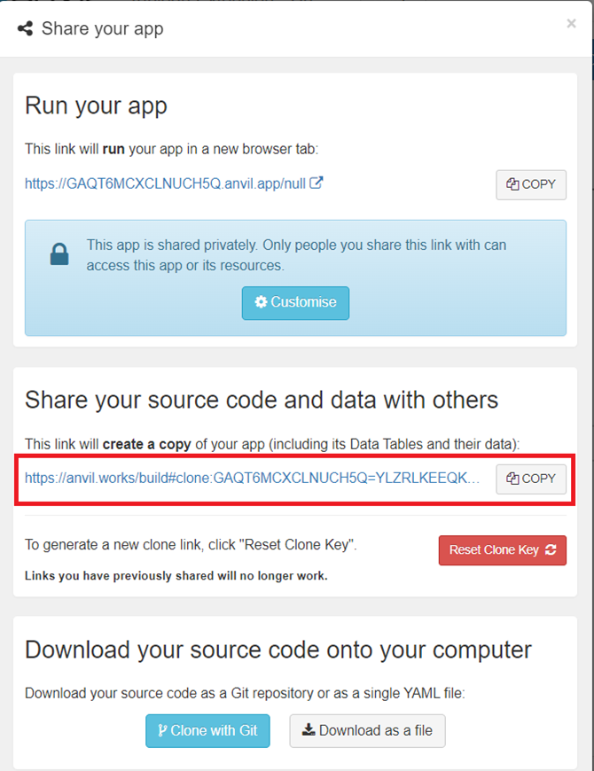

Chapter 8: Putting the finishing touches on our chat extension
===============================

We have learned several techniques for integrating Tableau with Anvil today. Time to tie it all together so that the chat extension is ready for your team’s use.

Let’s start by getting the name of the user currently logged into Tableau.

Step 1: Getting the name of the logged in user
~~~~~~~~~~~~~~~~~~~~

As it currently stands, there is no way to access this value with the Tableau dashboard extension API (darn it!) but we can still make hack this, per se.

Go into your Tableau dashboard and the ‘Sale Map’ sheet that your map is on, click on the carat under ‘Data’ to Create Calculated Field. Name it logged_in_username with the following username() call:

Press OK and locate your new calculated field under Tables -> Returns and drag ‘logged_in_user’ onto the map. Another way of getting this field to be a part of the live Tableau Dashboard is dragging the field over the Detail box in Marks:

Now head back to the Anvil app. We had to add this field as a dimension on our Dashboard so that it is available when we call ‘get_selected_records’, which retrieves all dimensions and measures associated with a selection (basically, what’s in the default tooltip). 

We can then grab this username from the record at the same time as grabbing our selected_state and sales:

.. code-block:: python

    else:
        record = user_selection[0]
        self.state_name = record['State']
        self.sales = record['SUM(Sales)']
        self.logged_in_user = record['logged_in_user']

Step 2: Updating the **button_add_comments_click** method to include user and sales
~~~~~~~~~~~~~~~~~~~~~~~

As it currently stands, our comments have no user or value for sales. Let’s change that.

Scroll down in main to the button_add_comments_click method. Line 5 is beginning to get too long for easy readability so let’s indent our code so that it looks like this:

.. code-block:: python

    app_tables.comments.add_row(
        comment=comment,
        timestamp=datetime.datetime.now(),
        id=self.state_name,
        value=self.sales,
        user=self.logged_in_user)

Good work! Now when we add comments, the table is properly filled.

Step 3: Update the event handler to query the database for relevant comments
~~~~~~~~~~~~~~~~~~~~~

Now that our comments data is full, we can update the event handler to query the data grid in main every time a mark is selected.

Data grids come with their own RepeatingPanel, an iterative list of items that fills the data grid. We will update this RepeatingPanel each time an event is caught. (More on the RepeatingPanel `here. <https://anvil.works/docs/client/components/repeating-panel>`_)

I will begin by writing a method in main that will update the repeating panel, when appropriate.

.. code-block:: python

    def update_repeating_panel(self):
        subset_of_data = app_tables.comments.search(
            tables.order_by('timestamp', ascending=False),
            id=q.full_text_match(self.state_name or "", raw=True),
        )
        self.repeating_panel_1.items = subset_of_data

3 things of importance in this code snippet: 

1.	Leaning on a bit of Anvil magic, we can assign the results of a table Search (a SearchIterator) directly to a repeating panel.

2.	We want to order the timestamp descending so that the most recent comments are at the top, so we add the argument ascending=False to the tables.order_by() argument.

3.	We would also like to query the database for comments made for only the selected state, so we use full_text_match() on the selected state_name with the argument raw=True to ensure that we only query rows with an exact match. 

Note: The reason behind the self.state_name **or** “” argument is that we will get an error if anything besides a string is the argument for full_text_match(). The ‘or’ call is a Pythonic way of replacing a result with another value if it does not exist. In the case of an un-select because None is not a value that exists, it reverts to the empty string. 

(When un-selecting a state, self.state_name will return None and we want to change that to a blank string so that none of the table is queried, and so full_text_match() does not give an error. This cross off two birds with one stone by also clearing the repeating panel by setting it’s items to None if the user deselects something in our selection_changed_event_handler)

More on Data Table queries `here. <https://anvil.works/blog/querying-data-tables>`_ 

Now, call this method in at the end of the **selection_changed_event_handler** method and our application will be good to go:

.. code-block:: python
    
    def selection_changed_event_handler(self, event):
        user_selection = event.worksheet.selected_records
        print(f"Got a selected record: {user_selection}, with length: ({len(user_selection)})")

        if len(user_selection) == 0:
            self.state_name = None
            self.sales = None
        else:
            record = user_selection[0]
            self.state_name = record['State']
            self.sales = record['SUM(Sales)']
            self.logged_in_user = record['logged_in_user']
        
        self.update_repeating_panel()

Done! Let’s try it out.

And...

Optional: Clone the app
~~~~~~~~~~~~~~~~~~

You can click the following link and explore it yourself or read on as we take a step-by-step guide to building it yourself:

`Click to clone the app. <https://anvil.works/build#clone:GAQT6MCXCLNUCH5Q=YLZRLKEEQKAPDA4ZAT64R762>`_

As it currently stands, you cannot clone a Tableau Extension app in Anvil’s brand-new IDE. You will want to follow these steps to clone it:

First, click this button on the top of the screen to return to the Anvil Editor Classic.

Your screen should now look like this:

Click on the gear icon for settings and select ‘Share app…’

On this screen, copy the highlighted link into your browser or click the following link to clone the finished app.

.. raw:: html

    <h2>Try the finished app</h2>

For those of you who want to give the app a try before starting the tutorial. Why not submit an application to the finished app?

The Tableau dashboard your application will extend off is `here. <https://dashboarding.bakertilly.com/#/site/BTDemoSite/views/ChatExtension/Overview?:iid=1>`_

.. raw:: html

    <h2>New to Anvil?</h2>

If you’re new here, welcome! Anvil is a platform for building full-stack web apps with nothing but Python. No need to wrestle with JS, HTML, CSS, Python, SQL and all their frameworks – just **build it all in Python**.

Yes – Python that runs in the browser. Python that runs on the server. Python that builds your UI. A drag-and-drop UI editor. We even have a built-in Python database; in case you don’t have your own.

Why not have a play with the app builder? **It’s free!** `Click here <https://anvil.works/>`_ to get started: