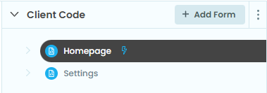
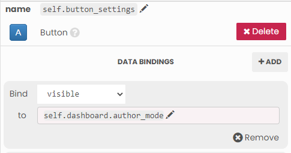

Configuring 'Settings' for your Dashboard
------

.. image:: 1-button-visibility-binding.png

In this tutorial we will define some "Settings" that allow you to configure your Extension for your users. Settings are persisted in the Workbook, so you can use them to set parameters used by your dashboard.

In this tutorial, we'll use Settings to select a column name, so that you can configure your extension to work with that column. In this case, we want to show the user the comma-delineated list of uniue values in a selection, for that worksheet and that field.

1. Create a Settings Page
2. Make that Settings Page accessible when the workbook is in Author mode
3. Use dropdowns to give users the ability to select from a list of options
4. Get the list of worksheet names and list of fields from a worksheet, and let the user pick one from the dropdowns.
5. Use that Setting to control which field the extension acts on in the workbook.

We'll start with the Superstore example that comes packaged with Tableau.

.. raw:: html

  

  <h2>Adding Anvil Code</h2>

To start, you'll need to create 2 forms in Anvil.

.. raw:: html

  <h3>Homepage (form)</h3>

This is main page of the extension, which is what the user will see embedded in the dashboard. It should have the following components:

- Button named ``btn_settings``, click bound to ``btn_settings_click``
- Label named ``lbl_field``
- Label named ``lbl_field_sum``

.. raw:: html

  <h3>Settings (form)</h3>

This is the page we'll show to the user for them to select a Field:

- Label named ``label_1``
- dropdown named ``dropdown_field_options``

    .. image:: media/1-settings-page.PNG

.. raw:: html

  <h3>Configure (form)</h3>

This is the form that will appear in the popup window, and it has the following components:

- Button named: ``btn_submit``, click bound to ``btn_submit_click``
- Label named: ``lbl_config``
- Text box named: ``tb_config``

    .. image:: media/1-settings-page.PNG

Once you've added the above components, the "Client Code" section of the Anvil IDE should look like this:

Note that the ``startup`` module has the lightning bolt next to it, indicating that it has been selected as the startup module.

.. raw:: html

  

  <h2>Accessing Settings in Author mode.</h2>

First, lets make it so that dashboard authors (and only dashboard authors) can access the settings.

To do this, we want to make the "Settings" button visible only in author mode. Typically we get the dashboard object like this::

  from tableau_extension import api
  dashboard = api.get_dashboard()

However it's often helpful if we also make this dashboard an attribute of our forms. This lets us use it in data bindings.

Data bindings are powerful mechanisms which we can use to drive our user interface from our object model, and save a lot of code. They are wonderful: learn more about them here. https://anvil.works/docs/client/data-bindings

For now, we will set a reference to the dashboard as an attribute of the Homepage.::

  from tableau_extension import api
  dashboard = api.get_dashboard()

  class Homepage(HomepageTemplate):
      def __init__(self, **properties):
          self.dashboard = dashboard
          self.init_components(**properties)

Now, lets bind the visibility of the Settings button to the dashboard ``author_mode``.

That's it! Whenever the ``visibility`` of the button is determined (like when ``init_components`` occurs), it's set to the dashboard.author_mode. The net result is our Settings button is only shown to authors.

When the User clicks on the Settings button, we'll show the Settings configuration form as a pop-up. For simplicity we'll use the Anvil alert mechanism. You could also use the Tableau alert mechanism: To learn more, see THAT OTHER TUTORIAL. We have to import a reference to Form and instantiate the Setting form in an alert when that button is clicked.

At the top of your code::

  from ..Settings import Settings``

And, double-clicking on the button in the Design pane, we establish the event handler, which should pop up the settings configuration screen. After the alert is closed, we'll print the settings so we can see what the updated state is.::

  def button_settings_click(self, **event_args):
      """This method is called when the button is clicked"""
      anvil.alert(Settings(), large=True)
      print(self.dashboard.settings)

If you run the Extension now, you'll be able to click that button and pop up the Settings form. So, let's move on and create the settings input.

.. raw:: html

  

  <h2>Configuring Worksheet and Field settings.</h2>

To start with your form should look like:

.. image:: 1-settings-form.png

Dropdown components require you to define the valid options. First, let's define the worksheets in the workbook.

You'll need to import the dashboard again, and again, we'll add a reference to it as an attribute to our form.

For the first dropdown, we want the user to select the name of the worksheet we care about::

  from tableau_extension import api
  dashboard = api.get_dashboard()

  class Settings(SettingsTemplate):
      def __init__(self, **properties):
          self.dashboard = dashboard
          self.drop_down_worksheet.items = [ws.name for ws in self.dashboard.worksheets]

For the second dropdown, we want to show the fields of the selected worksheet - in other words, we don't know what values to show until the worksheet is selected! We'll write a function that deals with this.

This function is going to get a reference to the worksheet from the dashboard object by name, get all the summary records in the worksheet, which is the detail that is reported when users make selections. We'll just take the first row and capture all the keys, and set those to the dropdown options.::

    def get_fields(self, worksheet_name):
        worksheet = self.dashboard.get_worksheet(worksheet_name)
        all_records = worksheet.get_summary_records()
        schema = all_records[0].keys()
        self.drop_down_field.items = schema

We want to call this function in two places: First, when the form is loaded, and second, when a new worksheet is selected from the dropdown.

First, in the init, we should check to see if that setting exists, and if so, fetch the fields in that workbook. So your init should look something like::

  class Settings(SettingsTemplate):
      def __init__(self, **properties):
          self.dashboard = dashboard
          self.drop_down_worksheet.items = [ws.name for ws in self.dashboard]
          if 'worksheet_name' in self.dashboard.settings':
              self.get_fields('worksheet_name')

And, when the user makes a worksheet selection, we want to call that again. So double-clicking on the worksheet dropdown, we can add the event handler for the dropdown changed event. We can use these same drop_down changed events to handle the assignment to settings.::

    def drop_down_worksheet_change(self, **event_args):
        """This method is called when an item is selected"""
        self.get_fields(self.drop_down_worksheet.selected_value)
        self.dashboard.settings['worksheet_name'] = self.drop_down_worksheet.selected_value

    def drop_down_field_change(self, **event_args):
        """This method is called when an item is selected"""
        self.dashboard.settings['field'] = self.drop_down_field.selected_value
``

## Aside
  It's often a good idea to define 'default' values for your settings at the very beginning of your init. You can then use those settings in bindings; if the setting key doesn't exist when ``init_components`` is called, you'll get a ``KeyError`` in your bindings. You can use ``setdefaults`` for this. This would have allowed us to handle the assignment to dashboard.settings using bindings. See the completed example for how that can be done.

Finally, let's set some placeholder values to instruct our users what to do. In the dropdowns, set the 'placeholder' value for drop_down_worksheet as "Select a worksheet", and the 'placeholder' for drop_down_field as "then select a Field". (Placeholder values are shown when the ``selected_value`` is ``None``.)

You might be wondering if we need to 'return' our settings (or even define how to close our dialog box!). Because we are showing our Settings form in an alert, there's already a button in place that will 'close' the Settings pop-up. And, because our settings are persisted in the workbook directly, there's no need to return them - they are immediately available through ``dashboard.settings`` from our Homepage form (and everywhere else!).

We've now populated our dropdowns from our dashboard, and allowed the users to set some settings using the dropdowns. If you run your extension at this point, you should be able to select a worksheet and a field on that worksheet, and see those updated settings 'printed' when you close the dialog. We're nearly done - let's go use those settings in our extension.

.. raw:: html

  

  <h2>Using our Settings</h2>

In this simple example, we want to comma delineate all the values for the field and worksheet we specified. So, let's write this event handler.::

  def selection_made(self, selection_event):
      # First we get all the records in the worksheet that triggered the selection event
      all_records = seletion_event.worksheet.selected_records

      # Then we get just the value for the field we care about, and ensure it's a string type
      all_values = [str(self.dashboard.settings['field']) for r in all_records]

      # We turn it into a python 'set' to depulicate the values
      distinct_records = set([r)

      # And comma-delinate these values by 'joining' it with a comma.
      self.label_all_values = ", ".join(distinct_records)

Next, we have to register our event handler. We'll do this in the init. ::

  def __init__(self, **properties):
    self.dashboard = dashboard
    if "worksheet_name" in self.dashboard.settings:
        worksheet = self.dashboard.get_worksheet(self.dashboard.settings['worksheet_name']
        worksheet.register_event_handler("selection_changed", self.selection_made)

Since we register our event handler in the init, we have to warn our dashboard authors that they'll have to reload the extension for the new settings to be applied.

We'll pop up an alert warning the user of this, after changing the settings.

So, our final ``button_settings_click`` includes this alert::

  def button_settings_click(self, **event_args):
      """This method is called when the button is clicked"""
      anvil.alert(Settings(), large=True)
      print(self.dashboard.settings)
      anvil.alert("Reload the Extension for the new settings to be applied.")

And that's it. To recap:
- We added a button visible only to dashboard authors that configures how the extension operates in the specific workbook in which it's embedded.
- We add a form that appears when that button is clicked that allows the user to change the settings only to valid values based on reading in the worksheet names and field names from the workbook.
- We use these settings to specify which worksheet we want to 'listen' for selections on, and for which field to act o.

Next steps:
- Have the 'Alert' pop up as a Tableau UI instead of an Anvil alert.
- Use bindings in your Settings to show previously selected values and clean up some code.
- Re-register your event handlers when settings change so you don't have to reload the extension.

Resources:
- Clone Link to 'completed' Settings tutorial.