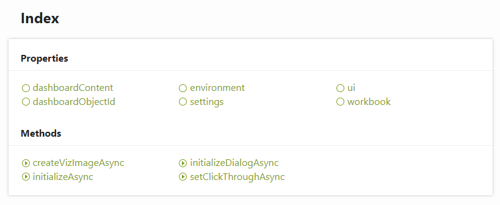

Accessing the JavaScript API
----

If there are methods or objects you'd like to use that are not implemented in the Python wrapper, the entire JS API can be accessed directly from the ``tableau`` module. For a more in depth conversation around accessing JS objects from Anvil, see the `Anvil documentation <https://anvil.works/docs/client/javascript#using-javascript>`_.

To get a taste of what's available, let's take a look at the attributes of ``tableau.extensions``.

.. code-block:: python

    # This import will be automatically added to your code in Anvil when you create a 
    # new Tableau Extension
    >>> from anvil import tableau
    >>> obs = [x for x in dir(tableau.extensions) if not x.startswith('_')]
    >>> print(obs)

    ['constructor', 'createVizImageAsync', 'dashboardContent', 'dashboardObjectId', 'environment', 
    'extensionImpl', 'get', 'initializeAsync', 'initializeDialogAsync', 'keys', 'setClickThroughAsync', 
    'settings', 'ui', 'workbook']

The corresponding Tableau extension documentation (`see here <https://tableau.github.io/extensions-api/docs/interfaces/extensions.html>`_) lists the following:

   
Note that the properties and method names in the above image are also included in ``dir(tableau.extensions)``, and these methods can be called from within Python. For example, taking a look at ``dashboardContent``:

.. code-block:: python

    >>> from anvil import tableau
    >>> print(tableau.extensions.dashboardContent.dashboard.objects)
    
    [<e (native JS) proxyobject>, <e (native JS) proxyobject>, <e (native JS) proxyobject>, 
    <e (native JS) proxyobject>, <e (native JS) proxyobject>, <e (native JS) proxyobject>, 
    <e (native JS) proxyobject>, <e (native JS) proxyobject>, <e (native JS) proxyobject>]
    
And we get some proxy objects back. 

   
The :doc:`popup` guide shows an example of using the underlying JS API instead of the Python wrapper to display a popup window in Tableau.
