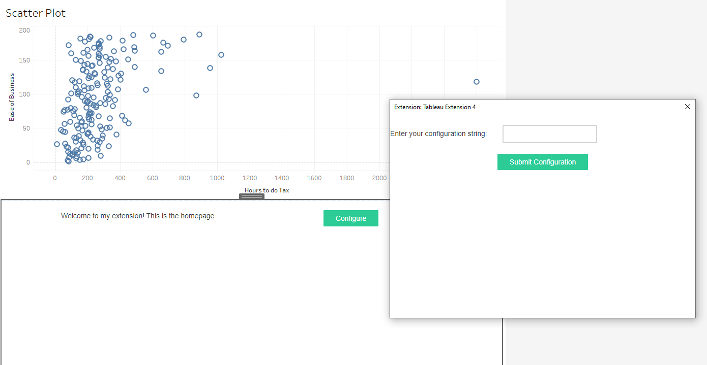
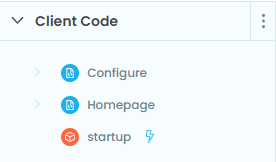

Displaying a popup within Tableau
------

.. https://anvil.works/new-build/apps/REN6GWNXX6Y5PODR/code/forms/Homepage

In this tutorial we'll add a Tableau pop-up that allows us to set an Anvil variable. To do this, we'll learn about a few things:

1. Accessing the underlying JS API
2. Trigger a pop-up dialogue box from Anvil
3. Encode URLs in Anvil
4. Using a startup module instead of a startup form in Anvil

Once we're done, we'll have something that looks like this:

You can download the Tableau dashboard :download:`here <popup_workbook.twb>` if you'd like to follow along.

To start, you'll need to create 1 module and 2 forms in Anvil.

- ``startup`` (module) 

  - This is a module that will contain some code that initializes the extension and routes the user to the appropriate page

- ``Homepage`` (form) 

  - This is main extension page, it has the following components:

    - Button named ``btn_config``, click bound to ``btn_config_click``
    - Label named ``lbl_config_setting``
    - Label named ``lbl_home``

- ``Configure`` (form) 

  - This is the form that will appear in the popup window, it has the following components:

    - Button named: ``btn_submit``, click bound to ``btn_submit_click``
    - Label named: ``lbl_config``
    - Text box named: ``tb_config``

Once you're done, the "Client Code" section of the Anvil IDE should look like this:

Because we'll be showing different forms based on some initial conditions, we'll use a startup module instead of a startup form. 

Let's start by adding some code into the ``startup`` module:

.. code-block:: python
  :linenos:

  # startup
  import anvil
  
  url_hash = anvil.get_url_hash()
  
  if isinstance(url_hash, dict):
    anvil.open_form('Configure')
  else:
    anvil.open_form('Homepage')

We take advantage of the ``get_url_hash`` method to route the user appropriately. As we'll see in the Homepage form, when a user clicks the "Configure" button ``get_url_hash`` will return a dictionary. In that case, we want to open the configure form. Otherwise they're just opening the extension for the first time so we serve the home page.

Now let's add some code into the ``Homepage`` form.

.. code-block:: python
  :linenos:

  # Homepage
  from ._anvil_designer import HomepageTemplate
  import anvil
  from anvil import tableau

  class Homepage(HomepageTemplate):
    def __init__(self, **properties):
      self.init_components(**properties)

    def btn_config_click(self, **event_args):
      # Define the url that should appear in the popup
      popup_url = f"{anvil.server.get_app_origin()}/#?entry=popup"

      # Initialize the popup window
      tableau.extensions.initializeDialogAsync()

      # Show popup_url in a popup window. 
      # This will return a string value that we can define, and 
      # it's saved into "out" when the dialogue box is closed by the user
      out = tableau.extensions.ui.displayDialogAsync(popup_url)

      # Update the label so we can see the value returned from the 
      # popup
      self.lbl_config_setting.text = out

The homepage has a single button that calls the ``btn_config_click`` method on click. That method opens the popup window. The "thing" that is served by the popup window is ``anvil.server.get_app_origin`` which makes the url hash a dict (this is handled in the startup module) and the "Configure" form is opened.

Let's move to the ``Configure`` form. Add the following:

.. code-block:: python
  :linenos:
   
  # Configure
  from ._anvil_designer import ConfigureTemplate
  from anvil import tableau

  class Configure(ConfigureTemplate):
    def __init__(self, **properties):
      self.init_components(**properties)

    def btn_submit_click(self, **event_args):
      tableau.extensions.ui.closeDialog(self.tb_config.text)

Now add the trex file to the Tableau dashboard (see :doc:`/getting_started`) and click the "Configure" button. The popup should appear, and whatever text you enter in the text box will appear once you close the dialog box with "Submit Configuration".

.. dropdown:: Here's what your extension should look like now
    :open:

    .. image:: media/popupdemo.gif

  
.. button-link:: https://anvil.works/build#clone:REN6GWNXX6Y5PODR=5UYQ4J4JS3U3X7O2LJEVOHRZ
   :color: primary
   :shadow:
   
   Click here to clone the Anvil app
