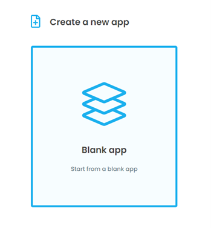
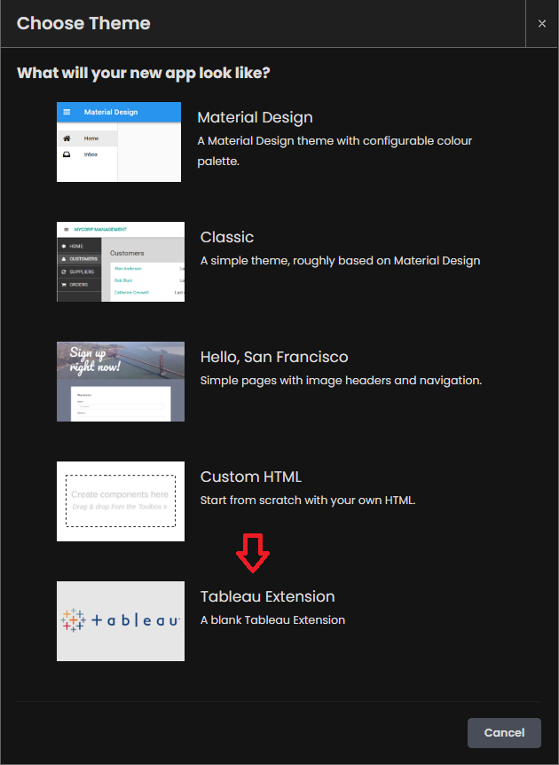
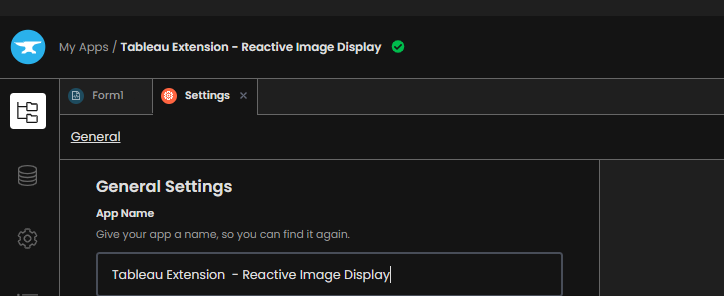
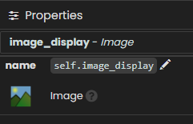

Chapter 1: Build your user interface
===================================

Let's start by building an application form using Anvil's drag-and-drop editor.

Step 1: Create your Anvil app
~~~~~~~~~~~~~~~~~~~~~~~~~~~~

Creating web apps with Anvil is simple. No need to wrestle with HTML, CSS, JavaScript or PHP. We can do everything in Python.

Log in to Anvil and click 'Create a new app - Blank App'. 

Choose the Tableau Extension theme.

First, name the app. Click on the name at the top-left of the screen and give it a name.

Step 2: Adding an Image Display to your form
~~~~~~~~~~~~~~~~~~~~~~~~~~~~

When we create an Anvil app, it is initialized with a Form named 'Form1'. A Form is a special kind of component that can play the role of a 'page' in Anvil. Form1 will serve as the main screen to our web application.

A Form is special because you can drag-and-drop components onto it in the visual designer. More on Forms `here. <https://anvil.works/beta-docs/client/components/forms>`_

We construct and improve the form by dragging-and-dropping components from the Toolbox.

Let's start by adding in an Image. Open up the toolbox, hover over the Image (circled below) and simply drag and drop it onto your Form.

When you create an Image (or any component in Anvil) it will be initialized with a name such as **image_1**. This is the Python name that you will use in code to edit and interact with this component. Typically we want to change these default labels to a more descriptive name to help keep track of and identify components.

Click on this button to close the toolbox:

.. image:: images/6-close-toolbox.png

Now, open the properties panel on the right. Click on the name **self.image_1** and replace **label_1** with a more descriptive name.

Nice, now we have an Anvil Form that our Tableau Dashboard will be able to interact with.

Note: The image source is initialized as empty. Later we will add a source so that an actual image appears.

In chapter 2 we will create the database for our Anvil web application.