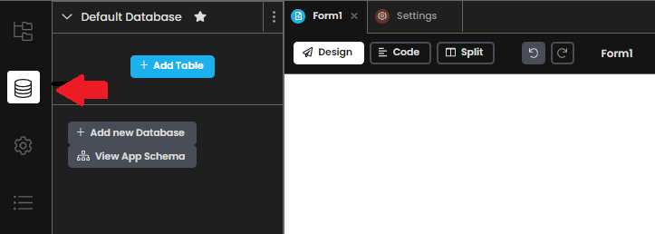
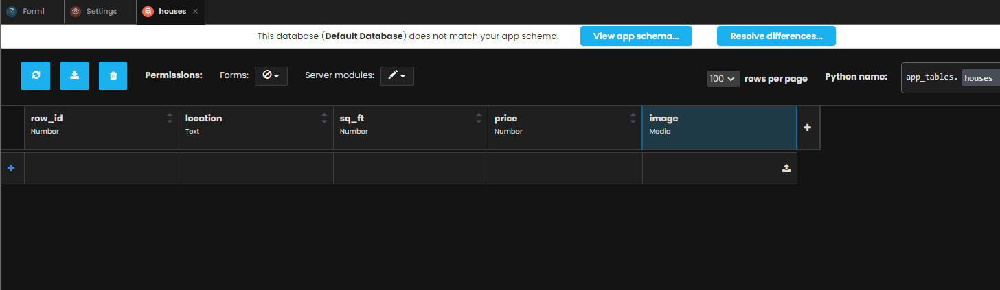
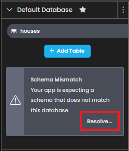
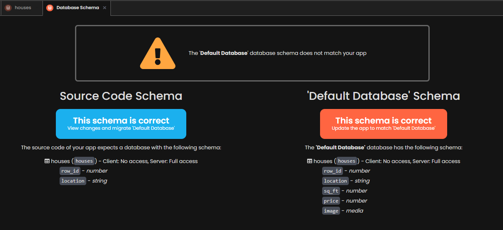
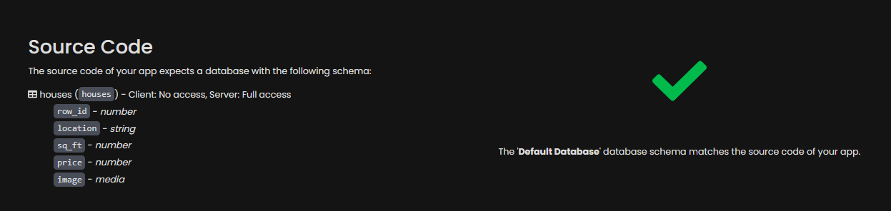
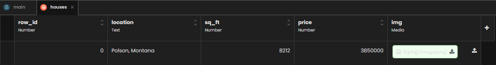
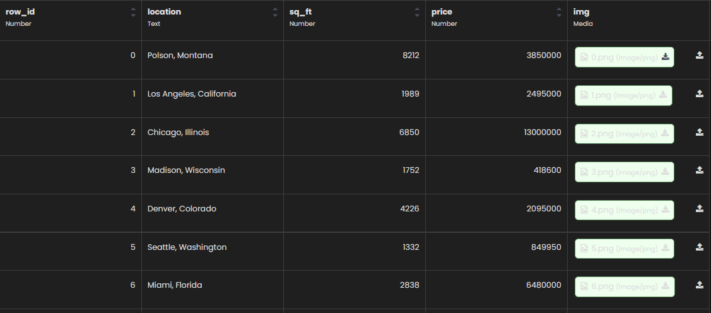
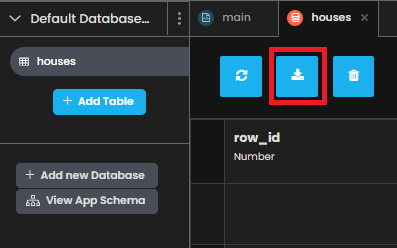

Chapter 2: Create your database table
===================================

Creating a database using Anvil's built-in Data Tables.

Step 1: Adding a database table
~~~~~~~~~~~~~~~~~~~~~~~~~~~~

Start by navigating to the Data tab on the left hand side of Anvil's environment:

You will see that there is already a Default Database with no tables of data in it. Let's change that!

Step 2: Create a 'houses' table
~~~~~~~~~~~~~~~~~~~~~~~~~~~~

For this tutorial, we are going to use data from houses on `Zillow <https://www.zillow.com/>`_ to observe the price and square feet measurements of houses in different locations.

Now set up your **houses** table with the following columns:

- row_id (Number column)

- location (Text column)

- sq_ft (Number column)

- price (Number column)

- image (Media column)

Here’s how to do that:

Click on the 'Add Table' button. You should now see an empty Data Table named **Table 1**. Double click on that name and rename your new data table to **houses**.

Next, add a column for the row ID, by clicking ‘+ New Column’ and choosing ‘Add number column…’. Call this column row_id’.

Keep adding columns until your Data Table has the structure we described above. Column titles are case sensitive, so let’s stick to lower case.

Your Data Table should look something like this:

Your Data Table is set up and ready to use. Nice work!

Step 3: Resolve Schema Mismatch
~~~~~~~~~~~~~~~~~~~~~~~~~~~~

When you create a new Data Table in the new Anvil environment, your app flags a warning that you have changed the 'schema' of your database.

Note: The term "schema" refers to the organization of data as a blueprint of how the database is constructed.

In order to resolve this and keep the changes you made to the database, you will need to do the following:

On the left hand side in the Schema Mismatch error message, click the 'Resolve...' button. 

Next, you should see a screen like this. As long as we agree with the changes that we made (which we should!) we are going to click on the big red 'update' button on the right.

There you go! You should now see this message, which means we are done creating our schema.

Now it is time to put some data into our houses data table.

Step 4: Inserting data into our data table
~~~~~~~~~~~~~~~~~~~~~~~~~~~~

Anvil makes it very easy to store data into Data Tables. More on this `here. <https://anvil.works/docs/data-tables>`_ 

Since we currently have no data, let's fix that.

Just like a spreadsheet, you can click to edit any data in the table. To add a new row, simply click in the blank row and start typing! 

Using `Zillow <https://www.zillow.com/>`_ we can easily find information on houses and enter them in. Here is something how the first row of data should look:

Note: For saving the images to our data table, I downloaded a picture of the house as a .png and uploaded it to this images column as 'media'.

Once you put some houses into your database (no need to insert more than a couple for this tutorial!) your data table should now look like this:

Step 5: Downloading the data table
~~~~~~~~~~~~~~~~~~~~~~~~~~~~

In the next chapter, we are going to need the data that we just created to be the data source for our Tableau Dashboard.

Luckily, downloading data tables as .csv is easy in Anvil. Simply scroll to the top and click this button:

Depending on your browser, a prompt should appear asking your where to store the file, or the file should be in your Downloads folder.

Nice work!

In chapter 3 we will build our Tableau Dashboard that interacts with the Anvil web application.