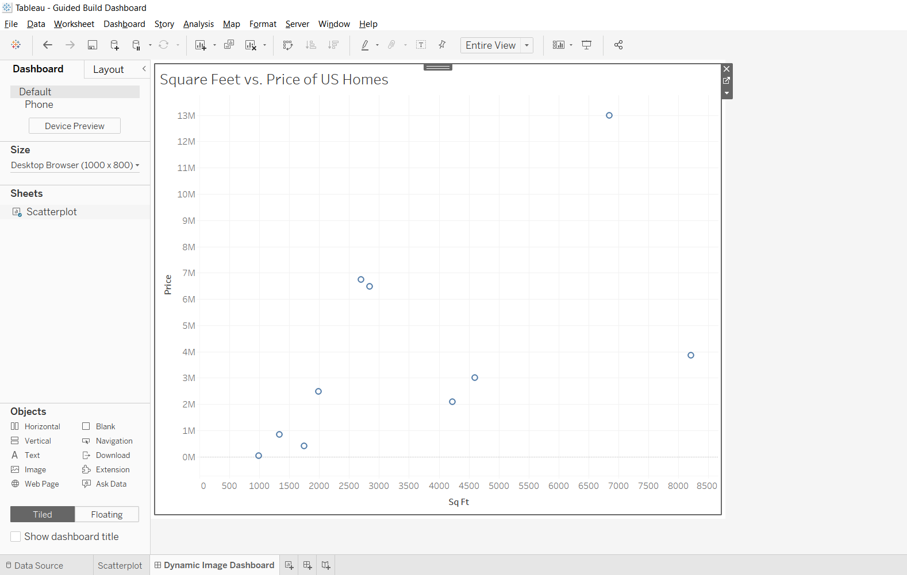
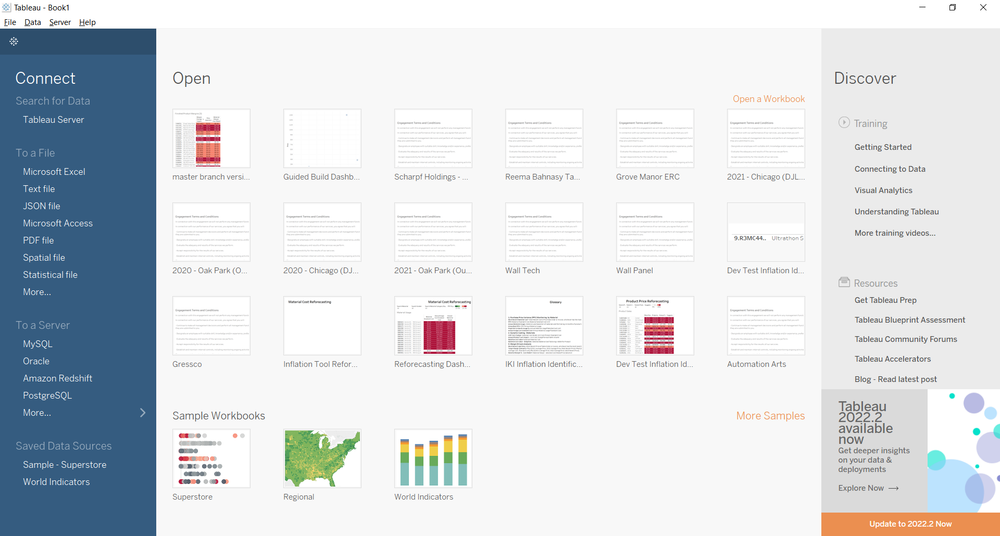
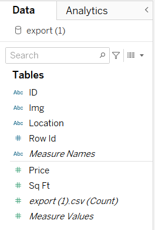
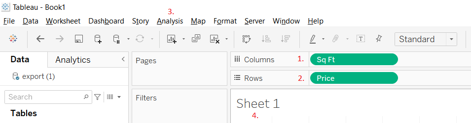
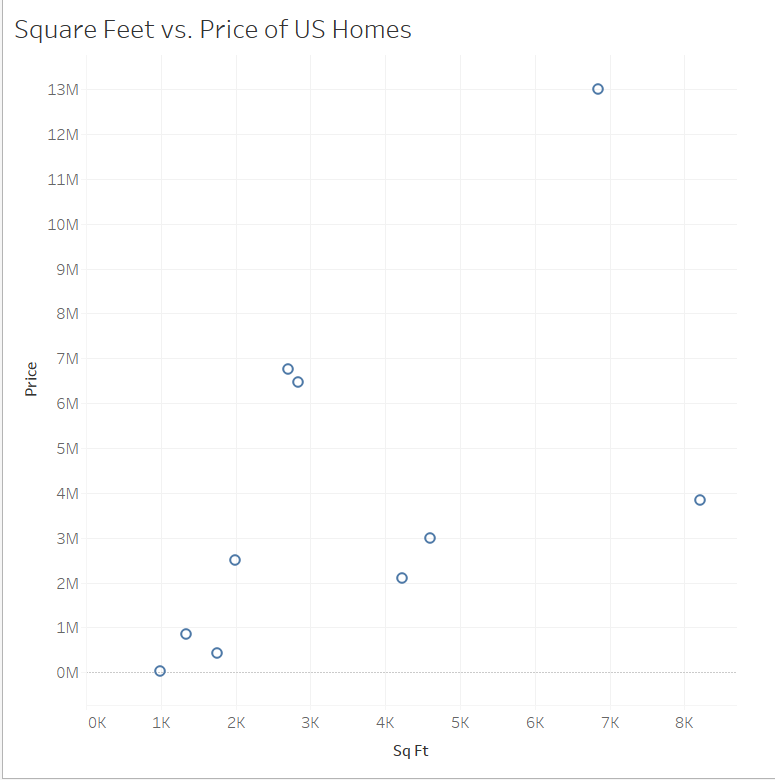
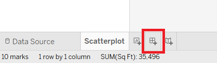
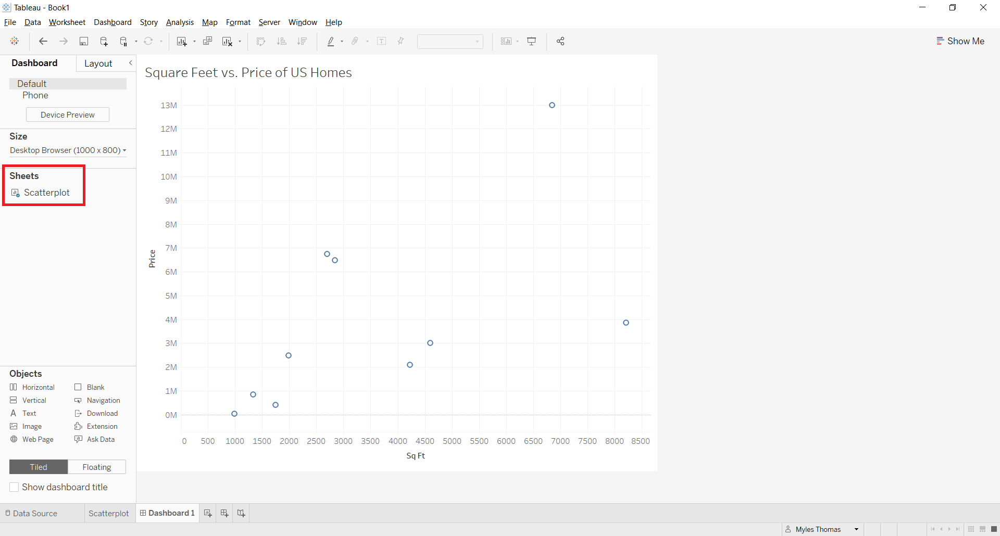
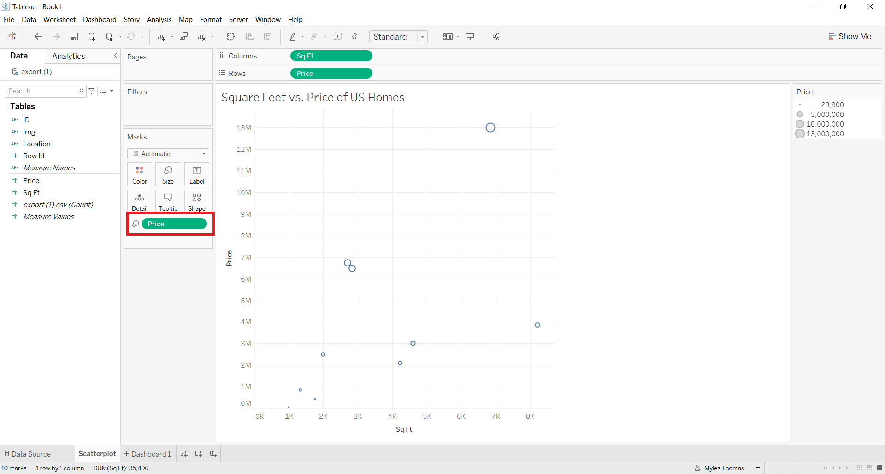
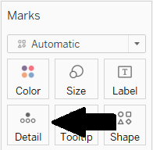
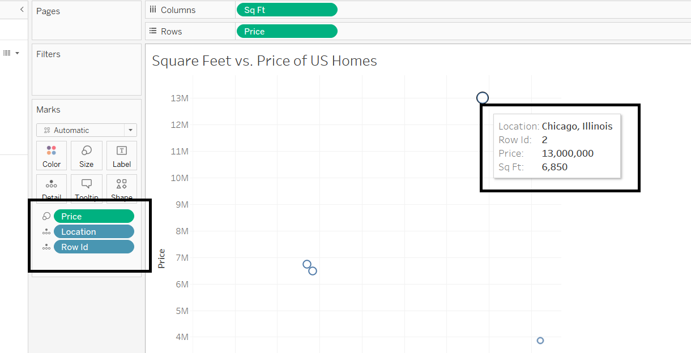

Chapter 3: Build your Tableau dashboard
===================================

Let's create a Tableau dashboard that we can use to select marks and have images reactively appear on the dashboard screen.

Step 1: Getting started with Tableau
~~~~~~~~~~~~~~~~~~~~~~~~~~~~

To follow along with this section it would help to know the basics of how to create and use Tableau worksheets and dashboards, but is not required. 

If you're brand new to Tableau, `Tableau's Desktop Tutorial <https://help.tableau.com/current/guides/get-started-tutorial/en-us/get-started-tutorial-home.htm>`_ has sections which will teach you everything you need to connect your data and make visualizations that are relevant to your company's goals.

For this tutorial, I have included an example dashboard that you may use to get familiar with Tableau and see the potential use-cases:

Step 2: Create a Tableau sheet
~~~~~~~~~~~~~~~~~~~~~~~~~~~~

Sheets are what Tableau Dashboards consist of, so let's make a sheet first.

Start by loading up Tableau Desktop. At startup you will see something like this:

On the left-hand side under 'To a file', click **Text file**. The reason we are connecting to a text file is because our export from Anvil data tables is default downloaded as a .csv file, and those files along with .txt files are considered text files.

Once you connect to your data source, in the bottom left you should see 'Sheet 1' automatically populate. Navigate there:

.. image:: images/18-go-to-worksheet.png

Right click on 'Sheet 1', and rename this sheet to 'scatterplot', since we are going to now add a scatterplot.

On the left-hand side under 'Data', you can see the tables from the database you've connected to as well as the field in each table. Our .csv file only contains one table, so it looks something like this:

Note: Blue variables represent categorical fields, green variables represent numeric fields.

You can make a quick scatterplot with the following steps:

1. Drag **Sq Ft** to the Columns at the top (x-axis)

2. Drag **Price** to the Rows at the top (y-axis)

3. Hover over the Analysis table. Uncheck the box 'Aggregated Fields' (Make sure to do this, otherwise your scatterplot will only contain one mark, the sum of each house's price and square feet.

4. Change the header from 'Sheet 1' to 'Square Feet vs. Price of US Homes'

Your sheet should now look something like this:

Step 3: Create a Tableau Dashboard
~~~~~~~~~~~~~~~~~~~~~~~~~~~~

Tableau Dashboards are the collection of one or more views or visualization where each view showcases a different kind of data at the same time. You can also add extensions to the Dashboards, as you will find out how to do so later.

For now we only have one sheet, so let's make a dashboard and put that sheet into it.

In the bottom left, click on this button to create your dashboard:

You should see a blank dashboard named 'Dashboard 1'. Double click on name in the bottom-left and rename it to 'Home'.

On the left-hand side of the dashboard screen you can find the other sheets created in the current Tableau Workbook.

Drag and drop 'Scatterplot' onto your new Dashboard.

Step 4: Customize the Tableau Dashboard
~~~~~~~~~~~~~~~~~~~~~~~~~~~~

Tableau has a number of marks, filters and parameters that you can edit to personalize your sheets and dashboards. We are going to change size of our scatterplot dots to reflect a mark's price, with bigger dots meaning a more expensive house.

To change the size of dots for our scatterplot, we must change it at the sheet level. In the bottom left you can see that we are currently on the Home dashboard, now switch over to the Scatterplot sheet. 

On the left-hand side, as we discussed before, quantitative variables are in green, categorical variables in blue. We want the houses with higher price darker bigger, so let's drag the quantitative variable Price' over the 'Size' box in the Marks section.

One last thing with the customization of this dashboard. (This is going to come in handy later, trust me!)

Because price and square feet are in the row columns, when we hover on or click one of the marks in Tableau, the sheet reacts and shows that data. We want this to happen for the rest of the relevant data for that observation, as well.

Drag the categorical variables **Row ID** and **Location** over the 'Detail' mark:

Now, when hovering over a mark, we are able to see all of the relevant attributes from that house.

That's it, we now have a Tableau dashboard ready to use alongside our Anvil app. Next up, let's get our Tableau dashboard's API credentials that we need to authenticate our API calls.

In Chapter 4, we'll begin sending the details of your actions in Tableau using the Tableau API.
