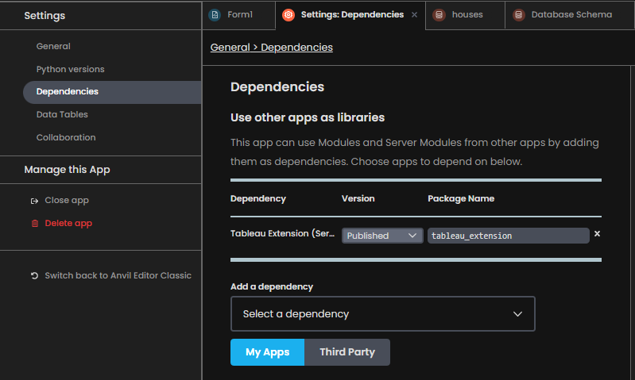
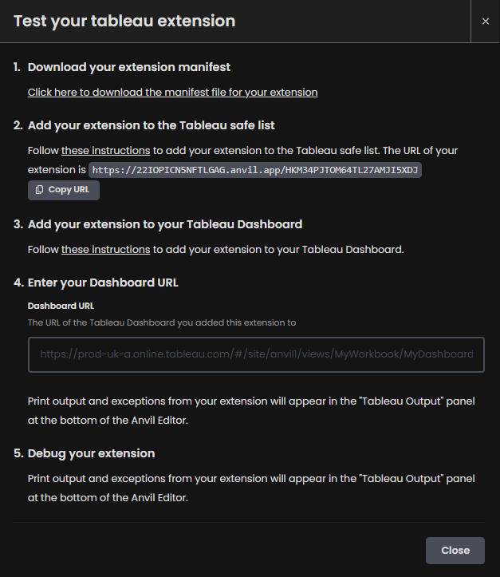
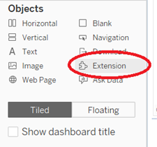
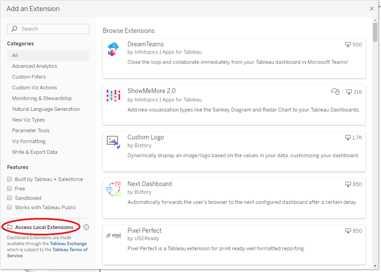
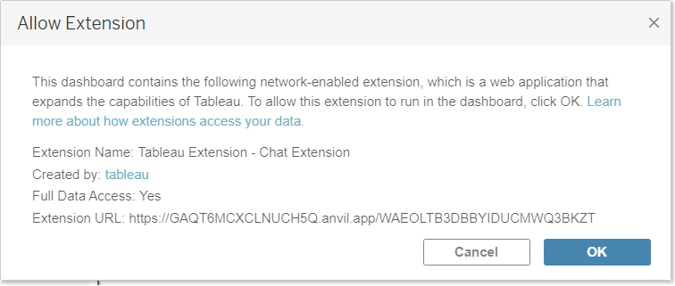
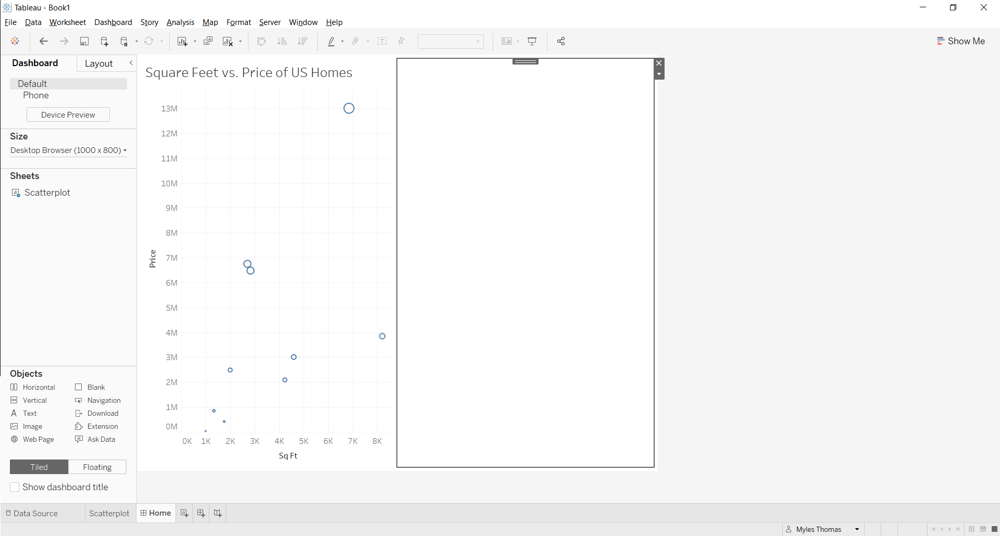
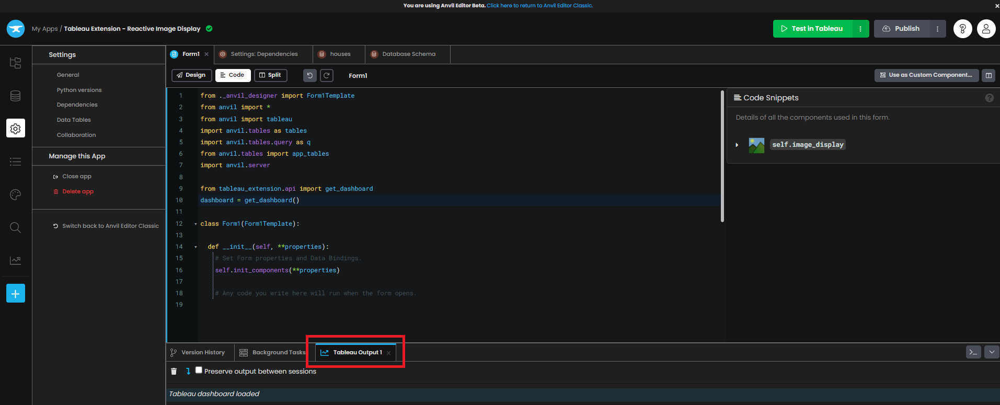
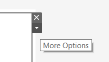
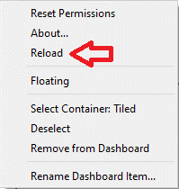
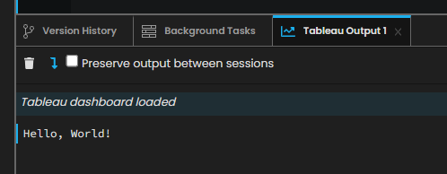

Chapter 4: Using the Tableau Dashboard Extension API
=====================================================

Let's start by going through the possibilities that the Tableau Dashboard Extension API offers.

Step 1: Adding a dependency
~~~~~~~~~~~~~~~~~~~~~~~~~~~~

The first step to allowing the Tableau Dashboard Extension API to interact with our Form is adding a dependency. Anvil apps can use Modules from other apps once they are added as dependencies.

Note: This step is optional, but the Tableau Extension dependency provides a much simpler mechanism for interacting with your Tableau Dashboard vs the native JS API.

On the left-hand side you will see Settings, the gear icon. Click on this and in the drop down for 'Add a dependency', select Tableau Extension (Service-based).

Finally, reload your browser (otherwise the autocomplete won't work later when writing code).

Step 2: Creating a .trex file
~~~~~~~~~~~~~~~~~~~~~~~~~~~~~~

For our Anvil app to call the Tableau Dashboard Extensions API it will need to create a .trex file that we import into our Tableau Dashboard as an extension.

We can generate this .trex file by clicking 'Test in Tableau' in the top right of our screen and following the instructions that appear on-screen:

Note: Only steps 1 and 3 are necessary if your Tableau Dashboard exists online in Tableau Desktop.

Step 1 provides a link to download your extension manifest. Clicking that link will direct you to download the extension of your application to your local computer. Once saved, open your Tableau Dashboard.

Step 3 provides instructions for adding your extension to your Tableau Dashboard. Start by locating the Extension button in the Objects pane.

Click on this button and drag 'Extension' onto the dashboard. This is when the following pop-up will appear:

Click on 'Access Local Extensions' in the bottom left and locate the .trex file that you just saved in the previous step. Press Open.

Finally, you should see this pop-up, to which you press OK.

Upon completion of these steps, your Tableau dashboard should now look something like this. We are now ready to have the Tableau Dashboard interact with our Anvil form.

Step 3: Importing the Tableau Dashboard Extension API Package
~~~~~~~~~~~~~~~~~~~~~~~~~~~~~~~~~~~~~~~~~~~~~~~~~~~~~~~~~~~~~

To have our Form communicate with the Tableau Dashboard, we must create the live Tableau dashboard in our Anvil form.

Open up Form1 and click on the code (or split) button at the top. At the code near the top of the form, from the **tableau_extension.api** dependency, import **get_dashboard** and create an instance of the dashboard in the form.

.. code-block:: python

    from tableau_extension.api import get_dashboard
    dashboard = get_dashboard()

This allows our form to have two-way communication with Tableau. We can find more information on the Tableau Extension API `here. <https://tableau.github.io/extensions-api/>`__

Step 4: “Hello World!” for the Tableau Dashboard Extension API Package
~~~~~~~~~~~~~~~~~~~~~~~~~~~~~~~~~~~~~~~~~~~~~~~~~~~~~~~~~~~~~~~~~~~~~~

Our Tableau Dashboard and Anvil web app are now able to have communication between each other. Let's test this out by doing a very simple task, having our Anvil Form print to the Tableau output upon its initialization.

Each Anvil Form has objects and methods that make them unique. One special method that each Form has is the __init__, or a series of actions that occurs each time the Form is initialized. More on form initialization `here. <https://anvil.works/docs/client/components/forms#how-forms-are-initialised>`__

The first thing that we are going to do is have our Anvil Form print “Hello, World!” to the Tableau Dashboard console, which is viewable at the bottom of the Anvil editor screen:

In the code for Form1's __init__ method, write the following line of code to have our message relayed to the Tableau Output screen:

.. code-block:: python

    def __init__(self, **properties):
        # Set Form properties and Data Bindings.
        self.init_components(**properties)

        # Any code you write here will run when the form opens.
        print("Hello, World!")

Our Anvil Form is now ready to print to the Tableau Dashboard.

We must refresh our Anvil application in the Tableau dashboard to reflect the changes we have made. You must do this every time you make changes to your forms to ensure you are running on the most up-to-date version of your app.

Go back to your Tableau dashboard and click on your Anvil app extension. In the top-right, you should see a carat for More Options. Click on that:

and press reload:

After completing this, go back into your Anvil web editor and look at the Tableau Output.

Nice! We now have proof-of-concept for our Form's two-way communication with Tableau.

In Chapter 5 we will build on this by registering an event handler that will make the app even better by allowing it to 'catch' when we click marks or make changes in the Tableau dashboard.
