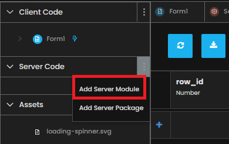
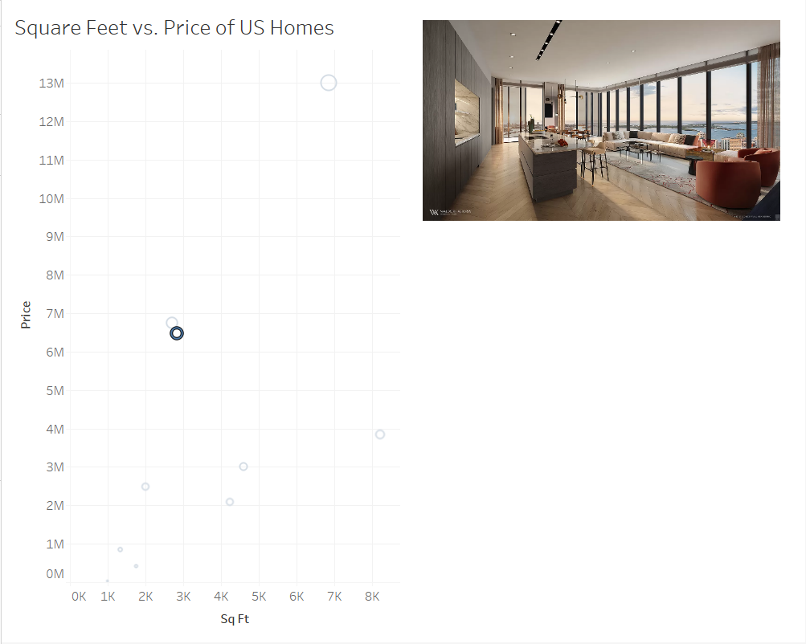

Chapter 6: Making the Event Handler useful
============================================

We have successfully created an event handler that logs information to the console. Let's add functionality to our event handler so that it knows which mark(s) are selected so that it can tell our Anvil app what data to store and/or put on the screen.

Step 1: Add the ability for the Event Handler to save data
~~~~~~~~~~~~~~~~~~~~~~~~~~~~~~~~~~~~~~~~~~~~~~~~~~~~~~~~~~~~~

Now that we can access the Tableau data, let's have our form access the Tableau data and update every time we click on a mark in the Tableau dashboard.

Note: We will take the first (0th index) state that was selected; this will work great if a user selects a single state. If a user selects more than one, we'll just take the first and record the details associated with that; you could do more with the full selection, but we'll keep it simple for now.

We also need to handle the instance when the user unselects on the dashboard; in this case, there will be no marks selected, so we will handle that by clearing our selection.

So heading back to main, we'll add some more logic to our **selection_changed_event_handler**.

Because we want to 'remember' the selection to associate these with comments later, we make them attributes of our form. When you do that, it's always a good idea to set a default value in your init:

.. code-block:: python

    class main(mainTemplate):
        def __init__(self, **properties):
            # Set Form properties and Data Bindings.
            self.location = ""
            self.sq_ft = 0
            self.price = 0
            self.row_id = None
            self.init_components(**properties)

            # Any code you write here will run when the form opens.
            dashboard.register_event_handler('selection_changed', self.selection_changed_event_handler)

        def selection_changed_event_handler(self, event):
            user_selection = event.worksheet.selected_records
            print(f"Got a selected record: {user_selection}, with length: ({len(user_selection)})")

            if len(user_selection) == 0:
                self.location = ""
                self.sq_ft = 0
                self.price = 0
                self.row_id = None
            else:
                record = user_selection[0]
                self.location = record['Location']
                self.sq_ft = record['SUM(Sq Ft)']
                self.price = record['SUM(Price)']
                self.row_id = record['Row Id']

This looks like a lot of code, but it really is simple.

•	If 0 marks are selected, we reset the location, square feet, price, and row ID to empty (Depending on the field: None, 0, or an empty string).

•	Otherwise, we take the first house and record the location, square feet, price, and row ID. (If you are using your own dashboard, then you'll have to decide what identifier and value you want to use, but any identifier and value will work. Your print(user_selection) will help a lot in figuring out what to use!)

Step 2: Accessing the photos saved in the database with the Event Handler
~~~~~~~~~~~~~~~~~~~~~~~~~~~~~~~~~~~~~~~~~~~~~~~~~~~~~~~~~~~~~~~~~~~~~~~~~~

Our end goal is to have our clicks in Tableau make images appear on the Anvil Form, right?

We need to find a way to have Anvil do the following when a mark is clicked:

1. Find out which house was selected (Done, we already are tracking this by way of **self.row_id**)
2. Go into the houses Data Table and grab the row that has the source for this house's image
3. Set the source for the **image_display** in our Anvil Form to this house's image

This is made very easy using app_tables and the fact that each Anvil Data Table is a Python object, accessible via code.

Let's start by retrieving the row from the database which contains the selected house's image.

Before adding this functionality, we should go over best practice when it comes to Data Security:

- Code for Forms (Otherwise known as Client Side) executes in the user's browser, so it is under the user's control. A determined attacker can access anything that your Forms are allowed to access.
- By default, access from Forms is restricted to each Data Table
- Server Modules are not under the user's control. So you can trust them not to return table data to unauthorized users.
- More on Data Security `here. <https://anvil.works/docs/data-tables/data-security>`_

On the left-hand side, navigate to App and click on the 3 dots next to Server Code. Add a server module.

Server modules allow you to write functions that can be called from anywhere inside of an Anvil Form. All you need to do is wrap your Server-callable function with the following wrapper, and you're good to go:

.. code-block:: python

    @anvil.server.callable
    def say_hello(name):
        print("Hello, " + name + "!")

Now that we know how what Server Modules are for and how to call the methods inside of them, let's write the code for our server function.

.. code-block:: python

    @anvil.server.callable
    def get_img_path(image_id):
        """
        Get the path for the image file from the 'houses' database for the id provided.

        Inputs
        --------
        image_id: int

        Outputs
        --------
        row: a row from data table 'houses'
        """
        row = app_tables.houses.get(row_id=image_id)
        return row

The above code does a few things:

1. @anvil.server.callable allows us to call the method from any Form
2. the method 'get_img_path' access the **app_tables.houses** Data Table by way of app_tables.houses
3. The .get() method takes a Data Table and find the row that matches the constraints. In this case, we are looking in the Data Table for the row where the row_id column matches in input, image_id.
4. The information from this row in the Data Table is returned to the Form it is called from.

Now that you have an idea of how this server function works, let's add it to our Form.

.. code-block:: python

    if len(user_selection) == 0:
        self.location = ""
        self.sq_ft = 0
        self.price = 0
        self.row_id = None
        self.image_display.source = None
    else:
        record = user_selection[0]
        self.location = record['Location']
        self.sq_ft = record['SUM(Sq Ft)']
        self.price = record['SUM(Price)']
        self.row_id = record['Row Id']
        selected_house = anvil.server.call('get_img_path', image_id=self.row_id)
        self.image_display.source = selected_house['image']

A few notes on this code chunk:

1. We are saving the return value from our server call, a row from the Data Table, to **selected_house**.

2. In the last line of code, by accessing the source from self.image_display, we are able to change what it shows to the screen.

3. When we select a mark in Tableau, we want this server function to be called and update the image_display's source. But, when we de-select a mark, we do not need to make the server call and can set the image source to None.

Reload your extension, you should now see something like this when you click on a mark.

Awesome! We have successfully set up our image display extension to react when we click a mark in Tableau.

In chapter 7 we will put the finishing touches on the application so that our reactive image display extension is ready to go!
