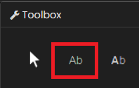
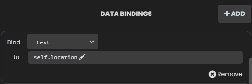
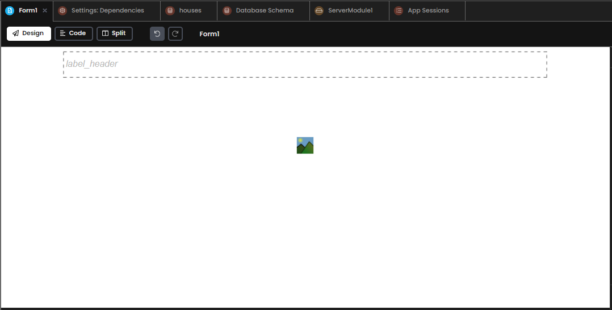
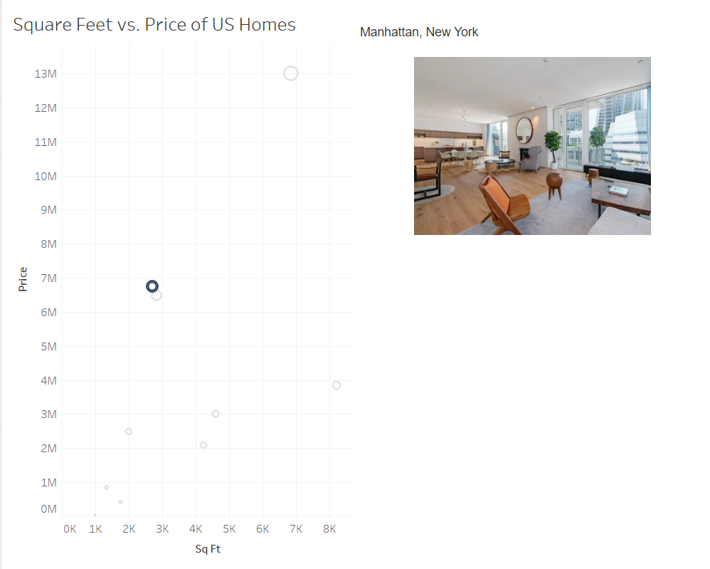
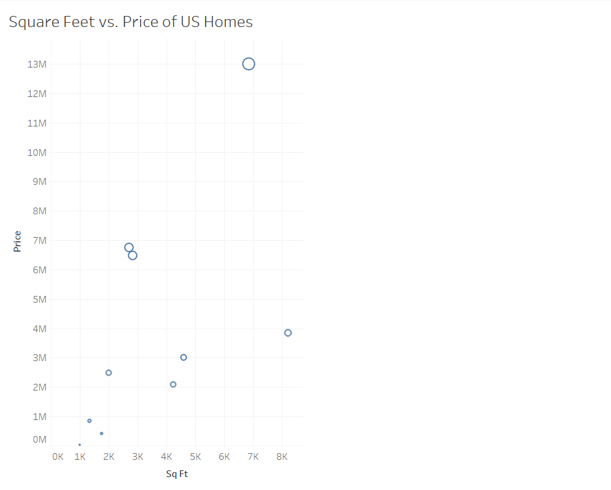

Chapter 7: Putting the finishing touches on our chat extension
===================================================================

We have learned several techniques for integrating Tableau with Anvil today. Let's tie it all together so that the reactive image display extension is ready for your team's use.

Step 1: Adding a reactive header
~~~~~~~~~~~~~~~~~~~~~~~~~~~~~~~~
Let's start by adding a Header so that our form has something more than just the reactive image display.

When we click on a mark, we want the House's location to appear on the Form. Otherwise, we do not want a location. How can we go about doing this reactively?

How can we do this you might ask? Data Bindings. Data Bindings are a way of keeping a component's properties in sync with the underlying data with minimal effort. More on this `here. <https://anvil.works/docs/client/data-bindings>`_

Remember, we already have an attribute (self.location) in our Form for this task. self.location is a blank string when nothing is selected, and updates when a mark is selected in Tableau.

Navigate to Form1's design pane, then toolbox and drag in a label:

Go to properties and rename your image to **self.label_header**. Then, under data bindings click '+Add' and Bind 'text' to 'self.location', like this:

Your screen should now look something like this:

One last thing before we test this out. Data Bindings are set when a Form is opened and do not refresh or update unless explicitly told to do so.

Let's add some code to the bottom of our **selection_changed_event_handler** method to make sure our data bindings refresh every time we select a mark in Tableau.

.. code-block:: python

    def selection_changed_event_handler(self, event):
        user_selection = event.worksheet.selected_records
        print(f"Got a selected record: {user_selection}, with length: ({len(user_selection)})")

        if len(user_selection) == 0:
          self.location = ""
          self.sq_ft = 0
          self.price = 0
          self.row_id = None
          self.image_display.source = None
        else:
          record = user_selection[0]
          self.location = record['Location']
          self.sq_ft = record['SUM(Sq Ft)']
          self.price = record['SUM(Price)']
          self.row_id = record['Row Id']
          selected_house = anvil.server.call('get_img_path', image_id=self.row_id)
          print(selected_house)
          self.image_display.source = selected_house['image']

        self.refresh_data_bindings()

See the bottom line of the code chunk. Each time 'self.refresh_data_bindings()' is called in the code, the Form's data bindings will refresh.

Done! Let's try it out. Go into Tableau, refresh your app and try clicking on a mark.

Nice! The location appears at the top of the Form. Let's make sure it goes away when we un-select a mark.

Great work!

Optional: Clone the app
~~~~~~~~~~~~~~~~~~~~~~~~~~

You can click the following link and explore it yourself or read on as we take a step-by-step guide to building it yourself:

`Click to clone the app. <https://anvil.works/build#clone:22IOPICN5NFTLGAG=NWE55F7OY5T6MIK3K73OQ5L3|7NA5SUPERPMMYP3A=2JADDUGUJKHP3VC5U6AI4IV5>`_
