Update Salesforce Opportunities
================================

Today we will be building a Tableau Extension with Anvil which can update a Salesforce Opportunity right from our Tableau dashboard!

Prerequisites
-------------

Experience with Python & Anvil
~~~~~~~~~~~~~~~~~~~~~~~~~~~~~~

Our demo is developed using Python 3 and `Anvil.Works <https://anvil.works/>`_. We recommend you have some Python programming experience to follow the guide. We also assume you are familiar with the basics of the Anvil platform and already have an account. If you don't, we recommend any of the great tutorials over at the `Anvil Learning Centre <https://anvil.works/learn/tutorials>`_.

Salesforce Environment
~~~~~~~~~~~~~~~~~~~~~~~~~~~~~~

We will be updating information in Salesforce with the demo. We recommend you use a Salesforce development environment to test. You can acquire an account following `this link <https://developer.salesforce.com/signup>`_.

* If you use your organizations environment, you will need to coordinate with the administrator to configure API authentication properly.

You should have the System Administrator role for the sake of this tutorial. By default, the user who creates a developer environment will have the system administrator role.

Tableau Environment
~~~~~~~~~~~~~~~~~~~~~~~~~~~~~~

We will create a simple dashboard to show case Extensions. We will be using Tableau Desktop 2021.2; other versions of Tableau should work as well. If you do not have a Tableau license, you can try it out in a `two-week trial <https://www.tableau.com/products/trial>`_.

Salesforce Credentials
~~~~~~~~~~~~~~~~~~~~~~~~~~~~~~

Collect your Salesforce Username, Password, and Security Token. We will need all three to connect to the Salesforce API. There are `other authentication methods <https://help.salesforce.com/s/articleView?id=sf.named_credentials_auth_protocols.htm&type=5v>`_ available outside the scope of this tutorial.

* If you do not know your password or security token, resetting your password will allow you to update both via the password reset email.

* If you just need your security token:
    * From your personal settings, in the Quick Find box, enter Reset, and then select Reset My Security Token.
    * Click Reset Security Token. The new security token is sent to the email address in your Salesforce personal settings.

Now Let's Get Started!

Tutorial Overview
-------------------

In this tutorial we will:

1. Create our User Interface
2. Add a Dependency
3. Enter our Credentials
4. Fetch Data from Salesforce
5. Write our Client Code
6. Bind Screen Elements
7. Time for Tableau
8. Update some Opportunities!

Chapter 1: Create our User Interface
~~~~~~~~~~~~~~~~~~~~~~~~~~~~~~~~~~~~~~

For this demo, we assume you already have an Anvil.Works account.

A Short Introduction
++++++++++++++++++++

We will start by logging in and creating a new application by selecting Blank App then selecting Tableau Extension

.. image:: media/image001.png

Now that we have our app, we want to create our form.
A brand-new app will look like this:

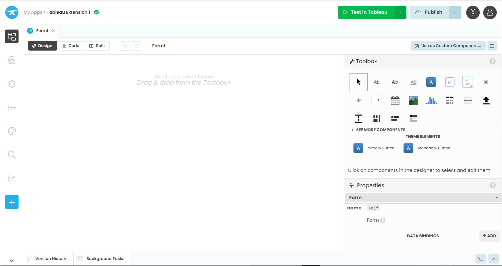

On the left side we have the app browser which we can use to switch between different parts of our app.
In the center we have the form editor where we will add our UI elements. We are looking at the design view right now. The form editor also has a code view where we will create our Python class for the form later.
On the right we have the toolbox where we will pick new components to add to the UI.

`Link to the full explanation of the Anvil Editor <https://anvil.works/docs/editor>`_

Create our First Form
+++++++++++++++++++++++

Our app will only have one form and we will use five Labels, a DropDown, a DatePicker, a TextBox, and a Button. We will use these elements to display all of the values we want to see and adjust later on.
We insert the elements in a single stack from top to bottom with the following properties:

* ``Label_1`` text: Opportunity Name
* ``Label_2`` name: self.label_opportunity_name
* ``Label_3`` text: Opportunity Stage
* ``DropDown_1`` self.drop_down_opportunity_stage
* ``Label_4 text``: Close Date
* ``DatePicker_1`` name: self.date_picker_close_date
* ``Label_5`` text Amount
* ``TextBox_1`` name: self.text_box_amount
* ``Button_1 name``: self.button_update_opportunity, text: Update Opportunity

    - click: ``button_update_opportunity_click``

We will be using the element names above in later sections if you need to reference them.
Feel free to stylize your form as you like. We also chose to change the standard labels appearance to blue and the button role to primary to help differentiate them from the other elements.
When you are all finished, your form should look something like this.

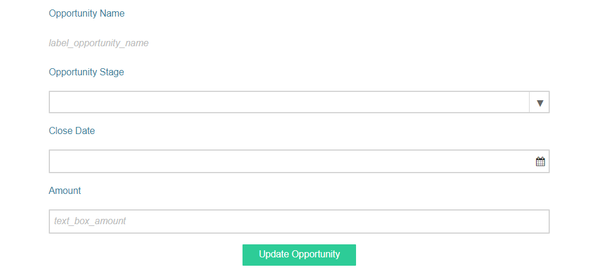

Chapter 2: Add a Dependency
~~~~~~~~~~~~~~~~~~~~~~~~~~~~~~~~~~~~~~
For our application to work, we need to add the Baker Tilly Extension library to our app. This library converts Tableau Extension library to Python and adds user-friendly features we can use in Anvil.

Replace with 3rd party key

To add a dependency, we go to Settings then Dependencies.

From this page pick the drop down under Add a dependency

The dependency we want is Tableau Extension (Service-based)

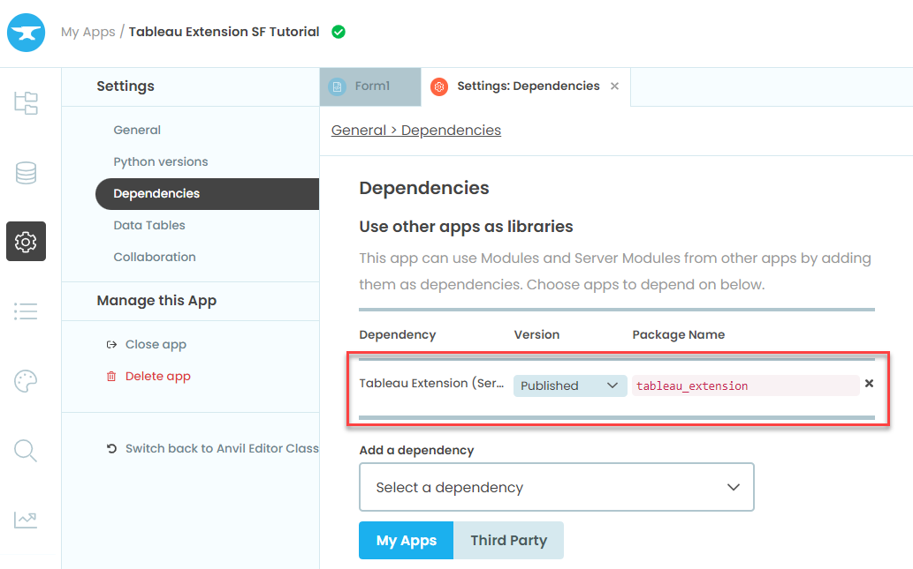

Chapter 3: Enter our Credentials
~~~~~~~~~~~~~~~~~~~~~~~~~~~~~~~~~~~~~~

Next thing we want to do is enter our Salesforce credentials so we can connect from Anvil.
To do this, we will add the App Secrets module to our app then create a function to connect to our Salesforce environment.

App Secrets
++++++++++++

App Secrets are a way to store sensitive information, so we don't need to store it in our source code be it API credentials, database passwords, or sensitive personal data.

You can find Anvil's tutorial on App Secrets `here <https://anvil.works/learn/tutorials/app-secrets>`_.

The first thing we need to do is enable App Secrets. You can do this by clicking the plus button at the bottom of the module list.

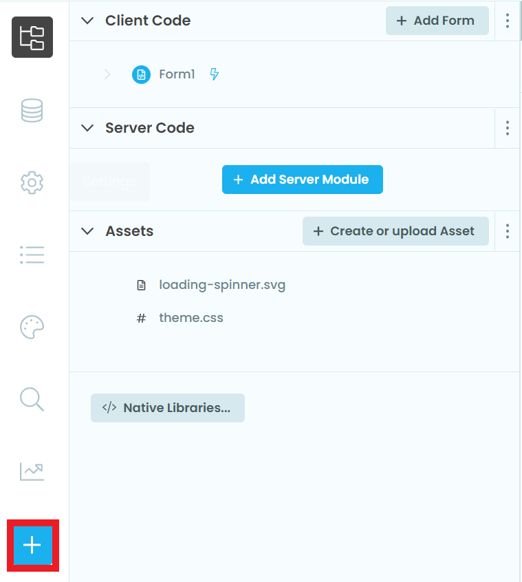

A pop up will appear with a list of features you can add to your app, we'll be selecting App Secrets.

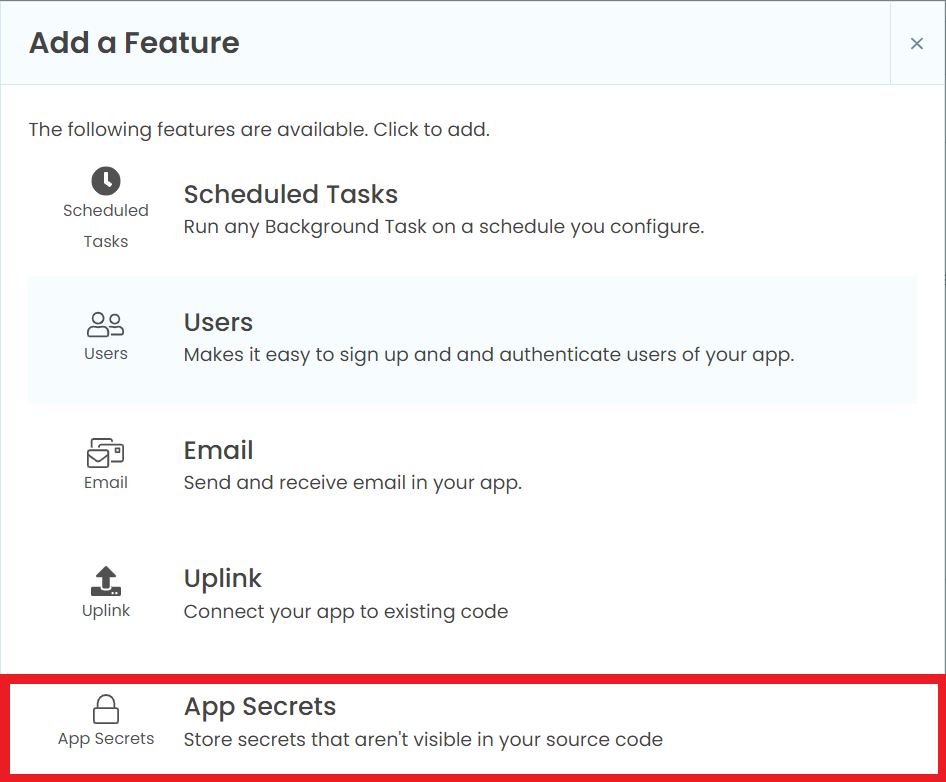

Once you've added Secrets, you'll see the icon appear in the module list. Select it. We will now create secrets for our Salesforce credentials.

Note if you are using your organization's Salesforce environment your API authentication procedure may differ.

Select Create a new secret.

A new line will appear where you can enter the name of your secret. We will start with ``sf_username``.

Now we want to select Set Value. A pop up will appear where you can enter your Salesforce username. This is the username you use to login to the Salesforce environment you are connecting to.

Repeat for your Salesforce password, ``sf_password``, and security token, ``sf_token``.

If you don't have your security token, you can reset it in Salesforce, and they will email you a new token.

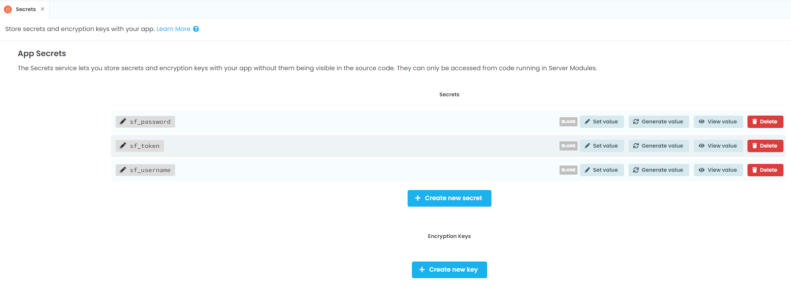

Server Functions
+++++++++++++++++

Now that we have our secrets, we will want to setup our first server function to connect to Salesforce.
The first thing we need to do is add our first server module. Navigate to the App tab in the list on the left and select Add Server Module.

For a more detailed explanation of Server Code see Anvil's documentation `here <https://anvil.works/docs/server>`_.

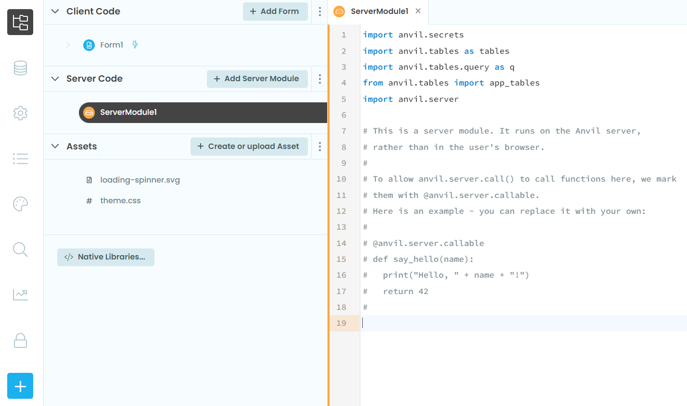

For our connection to Salesforce, we will need to import two libraries. The first is Secrets to access the credentials we created and the second is Simple Salesforce (`docs <https://simple-salesforce.readthedocs.io/en/latest/>`_) which we will use to connect to the Salesforce REST API using Python.

With secrets we use ``get_secret('secret_name')`` to get our credentials.
Once we have our credentials, we can authenticate using simple Salesforce shown below:

.. code-block:: python

    import anvil.secrets
    from simple_salesforce import Salesforce

    def salesforce_connect():
        username = anvil.secrets.get_secret('sf_username')
        password = anvil.secrets.get_secret('sf_password')
        security_token = anvil.secrets.get_secret('sf_token')
        sf = Salesforce(username= username , password= password , security_token= security_token)
        return sf

We can now use this function to fetch records from our Salesforce environment.

Chapter 4: Fetch Data from Salesforce
~~~~~~~~~~~~~~~~~~~~~~~~~~~~~~~~~~~~~~

In this chapter we will cover the Salesforce API, create two server functions to fetch opportunity information from Salesforce, and add a decorator to our server functions so we can access them from our client code.

* If you are using a Salesforce development environment, it will come preloaded with records for you to use.

Salesforce Opportunities
++++++++++++++++++++++++++

In today's tutorial we will be working with Opportunities which you can find in your Salesforce environment by going to Marketing then selecting Opportunities along the top ribbon.

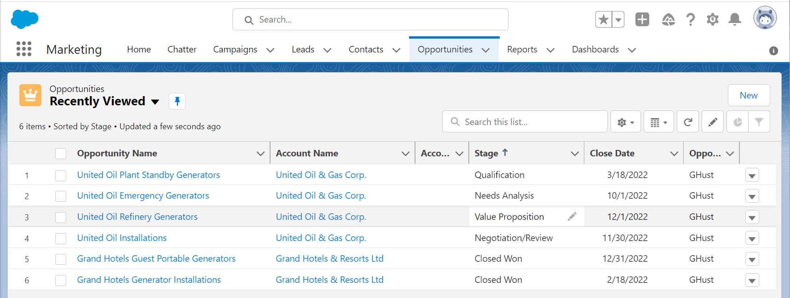

We can pick one of the opportunities from the list to open it and see all off the detail. We'll be updating the Stage, Close Date, and Amount.

.. image:: media/image020.png

Creating our Server Functions
++++++++++++++++++++++++++++++

We will be using two Salesforce Objects Opportunity and OpportunityStage. We will use a SQL query to get the all of the stages then use Opportunity object to get specific opportunity information.

`Salesforce Object Reference Documentation <https://developer.salesforce.com/docs/atlas.en-us.object_reference.meta/object_reference/sforce_api_objects_opportunity.htm>`_

Before we continue, we want to import pandas to hold our opportunity stage array

.. code-block:: python

    import pandas as pd

Now we are all set.

Use query with our Salesforce connection to get a list of all the different Opportunity Stages.

.. code-block:: python

    def opportunity_stages():
        sf = salesforce_connect()
        df_oppStage = pd.DataFrame(sf.query("SELECT MasterLabel FROM OpportunityStage LIMIT 200")['records'])
        oppStages = df_oppStage['MasterLabel'].tolist()
        return oppStages

Then we use ``sf.Object.get`` with an object ID to get the specific record we want to update. The ``opp_ID`` parameter will come from the Client side code later on

.. code-block:: python

    def get_opportunity(opp_ID):
        sf = salesforce_connect()
        opportunity = sf.Opportunity.get(opp_ID)
        return opportunity

Decorators
+++++++++++

In order for our users to interact with our sever functions we will need to call them using client functions. Server functions are not available to the client side by default, so we need to add a decorator ``@anvil.server.callable``.
Now our functions look like this:

.. code-block:: python

    @anvil.server.callable
    def opportunity_stages():
        sf = salesforce_connect()
        df_oppStage = pd.DataFrame(sf.query("SELECT MasterLabel FROM OpportunityStage LIMIT 200")['records'])
        oppStages = df_oppStage['MasterLabel'].tolist()
        return oppStages

    @anvil.server.callable
    def get_opportunity(opp_ID):
        sf = salesforce_connect()
        opportunity = sf.Opportunity.get(opp_ID)
        return opportunity

Update an Opportunity
+++++++++++++++++++++++

Finally, we can wrap our server code with an update function. We take the opportunity ID along with a dictionary of opportunity attributes, StageName, CloseDate, and Amount, from the client side as parameters.
We strip any records that are None.

Then submit the changes using ``sf.Object.update``

.. code-block:: python

    @anvil.server.callable
    def update_opportunity(opp_ID,change_dict):
        sf = salesforce_connect()
        sf_changes = {k:v for k,v in change_dict.items() if v is not None}
        if sf_changes:
          response = sf.Opportunity.update(opp_ID,sf_changes)

All Together
++++++++++++

.. code-block:: python

    import anvil.tables as tables
    import anvil.tables.query as q
    from anvil.tables import app_tables
    import anvil.server
    import anvil.secrets

    from simple_salesforce import Salesforce
    import pandas as pd

    def salesforce_connect():
        username = anvil.secrets.get_secret('sf_username')
        password = anvil.secrets.get_secret('sf_password')
        security_token = anvil.secrets.get_secret('sf_token')
        sf = Salesforce(username= username , password= password , security_token= security_token)
        return sf

    @anvil.server.callable
    def opportunity_stages():
        sf = salesforce_connect()
        df_oppStage = pd.DataFrame(sf.query("SELECT MasterLabel FROM OpportunityStage LIMIT 200")['records'])
        oppStages = df_oppStage['MasterLabel'].tolist()
        return oppStages

    @anvil.server.callable
    def get_opportunity(opp_ID):
        sf = salesforce_connect()
        opportunity = sf.Opportunity.get(opp_ID)
        return opportunity

    @anvil.server.callable
    def update_opportunity(opp_ID,change_dict):
        sf = salesforce_connect()
        sf_changes = {k:v for k,v in change_dict.items() if v is not None}
        if sf_changes:
          response = sf.Opportunity.update(opp_ID,sf_changes)

Chapter 5: Write our Client Code
~~~~~~~~~~~~~~~~~~~~~~~~~~~~~~~~~~~~~~
Now that we've completed our server code, we're moving back to the client side. In the first section we created the UI on the design slide of the form, to write our code we'll going to the aptly name Code tab.

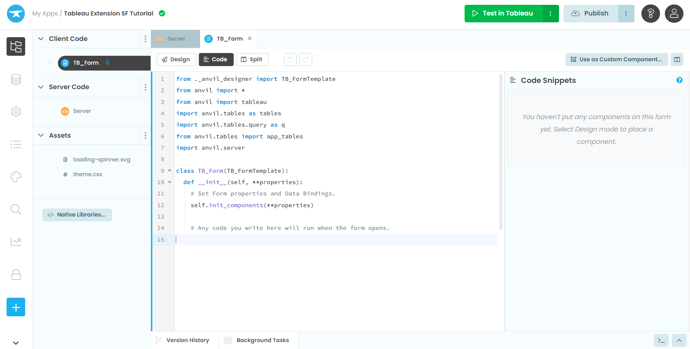

Init
++++

.. code-block:: python

    from tableau_extension import api
    dashboard = api.get_dashboard()

First thing we will do is import the tableau_extension library we setup all the way back in the dependency section. Then we are going to setup the dashboard object.

Create a dictionary to house the Opportunity attributes we want to change. We'll also call a function we haven't created yet ``self.reset()`` to clear the dictionary on screen load and refresh.

.. code-block:: python

    self.reset()
    self.new_dict = {
    	'StageName': None,
           'CloseDate': None,
           'Amount': None
        }

Call our get_opportunity_stages server function to fetch the list from Tableau. When calling server functions, we use the syntax ``anvil.server.call(function name', args, *kwargs)``

Then we want to stick those stages into a drop-down element in our screen. When you want to reference a screen element, we use ``self`` to reference the form class then the object name, ``self.object_name``.

We can assign a list to a drop-down property with items, ``self.drop_down_name.items``

`Anvil Docs on Drop Downs <https://anvil.works/learn/tutorials/database-backed-apps/chapter-3/30-populate-dropdown>`_

.. code-block:: python

    oppstages = anvil.server.call('opportunity_stages')
    self.drop_down_stage.items = oppstages

To finish off the init we're going to register the event handler. The event handler captures any selections the user makes in their dashboard so the extension can take action.

In our case, the event handler we give us the attributes of the selected Opportunity.

We want selection_changed and we'll call our event handler ``self.my_form_event_handler``.

All the code in this section goes before the line ``self.init_components(**properties)`` so it takes place before the form loads the UI.

.. code-block:: python

    dashboard.register_event_handler('selection_changed', self.my_form_event_handler)
    self.init_components(**properties)

Functions
++++++++++

In this section we will create the functions for our class.

Event Handler

In the extension library the event is the thing that changes when a 'selection_changed' occurs. We want all the records from each change.

If something did change, we want to assign class variables with selected value, in our case the opportunity the user picked. We get the rest of the information using our server function get_opportunity.

The event handler closes with ``self.refresh_data_bindings()``. Refresh data binding will update any screen objects with the new values, you will want to do this after changing any bound variables. We will bind screen objects in a later section.

.. code-block:: python

    def my_form_event_handler(self, event):
        selected_value = event.get_selected_records()
        if selected_value:
          try:
            self.opp_name = selected_value[0]['Name']
            self.opp_ID = selected_value[0]['Opportunity ID']

            self.opportunity = anvil.server.call('get_opportunity',selected_value[0]['Opportunity ID'])
            self.opp_stage = self.opportunity['StageName']
            self.opp_date = self.opportunity['CloseDate']
            self.opp_amount = self.opportunity['Amount']
          except KeyError:
            pass
        else:
          self.reset()
        self.refresh_data_bindings()

Reset
++++++

We're adding reset to allow the user to clear the selected opportunity on page refresh or by clicking on a blank space in the dashboard.

.. code-block:: python

    def reset(self):
        self.opp_name = None
        self.opp_ID = None
        self.opp_stage = None
        self.opp_date = None
        self.opp_amount = None

Clear Changes
++++++++++++++

Clear changes will change all the selections in our ``new_dict`` to None, we call clear changes after we submit the API request to update the opportunity. This prevents the extension from sending unnecessary update requests.

.. code-block:: python

    def clear_changes(self):
        self.new_dict = {x: None for x in self.new_dict}

Buttons
++++++++++

The remainder of our client code will handle screen events. Screen events occur when a user takes action on the UI like clicking a button or changing text in a text box.

You can find Events in the Container Properties. Go back to the Design view, look to the right side of the screen where you see Toolbox, then scroll to the bottom of the panel.

Depending on the screen component you've selected you you'll see different options like Show, Hide, Click, and Change.

`Anvil Documentation on Components and Events <https://anvil.works/docs/client/components>`_

Submit Changes

On the Design view select your Submit Changes button, scroll down on the right-side panel to the Container Properties section, click the blue button next to click.
This will open the split view and create the function ``button_submit_click``.

.. code-block:: python

    def button_submit_click(self, **event_args):
        """This method is called when the button is clicked"""
        pass

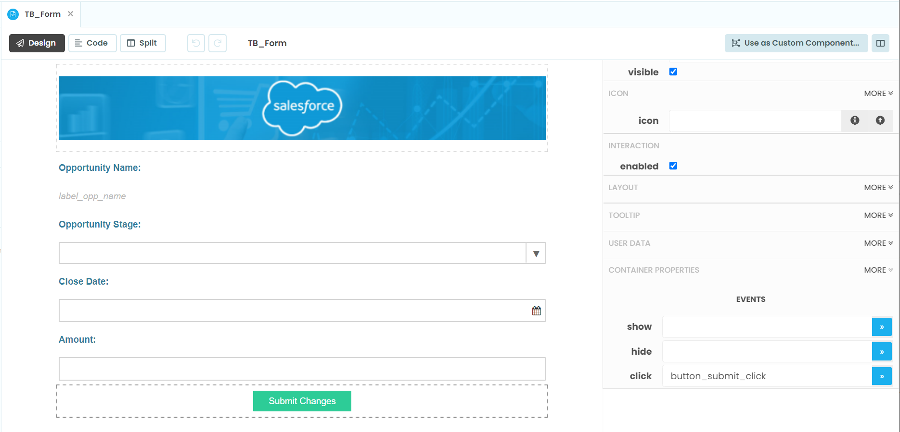

In the button submit click function we will add a call to the ``update_opportunity`` server function we created passing the ``self.opp_ID`` and ``self.new_dict`` as parameters.

If the return from the server function is True, we want clear our updates so we have a clean slate for any other changes.

Else, we'd like to create an alert letting the user know they haven't made any changes. Alerts generate a pop-up with content on the user's screen. Will we add a simple alert with some text.

`Anvil Documentation on Basic Components <https://anvil.works/docs/client/components/basic>`_

`Anvil Documentation on Alerts <https://anvil.works/docs/client/python/alerts-and-notifications>`_

.. code-block:: python

    def button_submit_click(self, **event_args):
        """This method is called when the button is clicked"""
        response = anvil.server.call('update_opportunity',self.opp_ID,self.new_dict)
        if response is True:
          self.clear_changes()
        else:
          alert('Please make a change before submitting.')

Pick from the Drop-Down
++++++++++++++++++++++++++

On the Design view select your Opportunity Stage drop-down, scroll down on the right-side panel to the Container Properties section, click the blue button next to change.

This will open the split view and create the function ``drop_down_stage_change``.

Assign the selected value from the drop down to the StageName variable in our new_dict and refresh the data bindings.

`Anvil Documentation on Basic Components <https://anvil.works/docs/client/components/basic>`_

.. code-block:: python

    def drop_down_stage_change(self, **event_args):
        """This method is called when an item is selected"""
        self.new_dict['StageName'] = self.drop_down_stage.selected_value
        self.refresh_data_bindings()

Change the Close Date
++++++++++++++++++++++++++

On the Design view select your Close Date date picker, scroll down on the right-side panel to the Container Properties section, click the blue button next to change.

This will open the split view and create the function ``date_picker_1_change``.

Assign the date from the date picker to the CloseDate variable in our ``new_dict``, convert it to iso format, then refresh the data bindings.

`Anvil Documentation on Basic Components <https://anvil.works/docs/client/components/basic>`_

.. code-block:: python

    def date_picker_1_change(self, **event_args):
        """This method is called when the selected date changes"""
        self.new_dict['CloseDate'] = self.date_picker_1.date.isoformat()
        self.refresh_data_bindings()

Enter an Amount
++++++++++++++++++++++++++

On the Design view select your Amount text box, scroll down on the right-side panel to the Container Properties section, click the blue button next to change.

This will open the split view and create the function ``text_box_amount_change``. Go back to the Design view then Container Properties then copy past ``text_box_amount_change`` into the pressed_enter field as well.

Assign the selected value from the text box to the Amount variable in our new_dict, convert the text to an Integer.

Assign the same integer to the ``opp_amount`` variable.

Refresh the data bindings.

`Anvil Documentation on Basic Components <https://anvil.works/docs/client/components/basic>`_

.. code-block:: python

    def text_box_amount_change(self, **event_args):
        """This method is called when the text in this text box is edited"""
        self.new_dict['Amount'] = int(self.text_box_amount.text)
        self.opp_amount = int(self.text_box_amount.text)
        self.refresh_data_bindings()

All Together
++++++++++++++++++++++++++

Init

.. code-block:: python

    from ._anvil_designer import TB_FormTemplate
    from anvil import *
    from anvil import tableau
    import anvil.tables as tables
    import anvil.tables.query as q
    from anvil.tables import app_tables
    import anvil.server

    from tableau_extension import api
    dashboard = api.get_dashboard()

    class TB_Form(TB_FormTemplate):
      def __init__(self, **properties):
        self.reset()
        self.new_dict = {
            'StageName': None,
            'CloseDate': None,
            'Amount': None
        }
        oppstages = anvil.server.call('opportunity_stages')
        self.drop_down_stage.items = oppstages
        dashboard.register_event_handler('selection_changed', self.my_form_event_handler)
        self.init_components(**properties)

Functions

.. code-block:: python

    def reset(self):
        self.opp_name = None
        self.opp_ID = None
        self.opp_stage = None
        self.opp_date = None
        self.opp_amount = None

    def my_form_event_handler(self, event):
      selected_value = event.get_selected_records()
      if selected_value:
        try:
          self.opp_name = selected_value[0]['Name']
          self.opp_ID = selected_value[0]['Opportunity ID']
          self.opportunity = anvil.server.call('get_opportunity',selected_value[0]['Opportunity ID'])
          self.opp_stage = self.opportunity['StageName']
          self.opp_date = self.opportunity['CloseDate']
          self.opp_amount = self.opportunity['Amount']
        except KeyError:
          pass
      else:
        self.reset()
      self.refresh_data_bindings()

    def clear_changes(self):
      self.new_dict = {x: None for x in self.new_dict}

Buttons

.. code-block:: python

    def button_submit_click(self, **event_args):
        response = anvil.server.call('update_opportunity',self.opp_ID,self.new_dict)
        if True:
          self.clear_changes()
          self.refresh_data_bindings()
        else:
          alert('Please make a change before submitting.')

    def drop_down_stage_change(self, **event_args):
        self.new_dict['StageName'] = self.drop_down_stage.selected_value
        self.refresh_data_bindings()

    def date_picker_1_change(self, **event_args):
        self.new_dict['CloseDate'] = self.date_picker_1.date.isoformat()
        self.refresh_data_bindings()

    def text_box_amount_change(self, **event_args):
        self.new_dict['Amount'] = int(self.text_box_amount.text)
        self.opp_amount = int(self.text_box_amount.text)

Chapter 6: Bind Screen Elements
~~~~~~~~~~~~~~~~~~~~~~~~~~~~~~~~~~~~~~

To finish off our form we are going to bind the screen components to the variables we created in chapter 5.
Data Bindings are a way of keeping a component's properties in sync with the underlying data with minimal effort.

To add data bindings go to the Design view, scroll down in the right panel to the Data Bindings section of Properties, then select + Add.

`Anvil Documentation on Data Bindings <https://anvil.works/beta-docs/client/data-bindings>`_

Opportunity Name
++++++++++++++++++++++++++

For opportunity name we want to bind the ``opp_name`` variable to the text of the label_opp_name text box.
Select the ``label_opp_name`` text box, navigate to Data Bindings, select + Add to bring up a new binding.
From the new box click the drop-down next to Bind and set the value to Text.
In the To section and the variable name ``self.opp_name``.

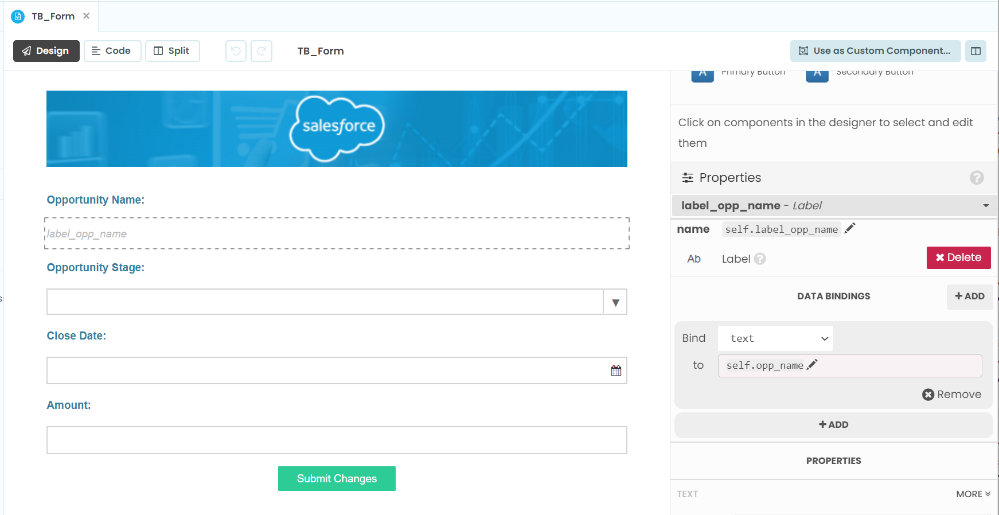

Opportunity Stage
++++++++++++++++++++++++++

For opportunity stage we want to bind the ``opp_stage`` variable to the selected value of the ``drop_down_stage`` drop-down.
Select the ``drop_down_stage`` drop-down, navigate to Data Bindings, select + Add to bring up a new binding.
From the new box click the drop-down next to Bind and set the value to Selected Value.
In the To section and the variable name ``self.opp_stage``.

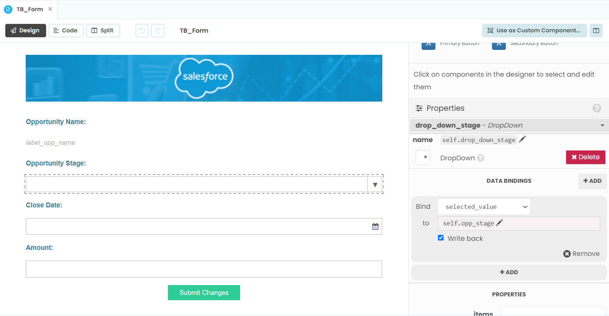

Close Date
++++++++++++++++++++++++++

For opportunity stage we want to bind the ``opp_date`` variable to the date of the ``date_picker_1`` date picker.
Select the ``date_picker_1`` date picker, navigate to Data Bindings, select + Add to bring up a new binding.
From the new box click the drop-down next to Bind and set the value to date.
In the To section and the variable name ``self.opp_date``.

Amount
++++++++++++++++++++++++++

For opportunity stage we want to bind the opp_amount variable to the text of the ``text_box_amount`` text box.
Select the ``text_box_amount`` text box, navigate to Data Bindings, select + Add to bring up a new binding.
From the new box click the drop-down next to Bind and set the value to text.
In the To section and the variable name ``self.opp_amount``.

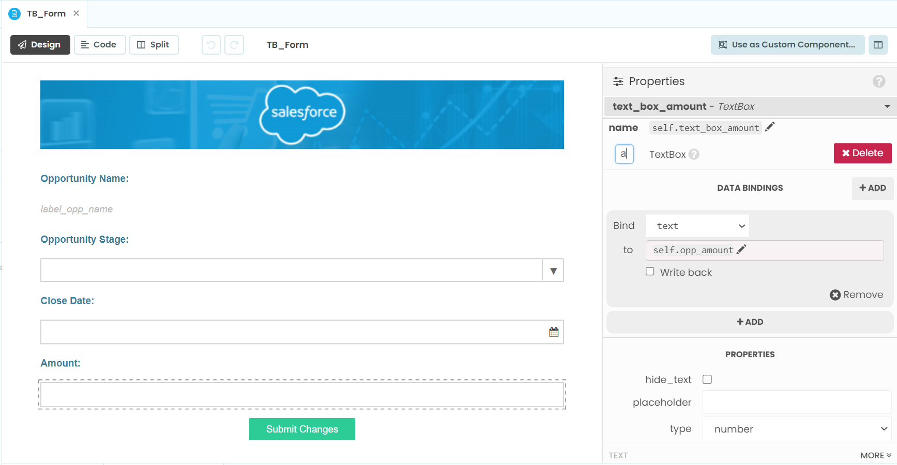

Chapter 7: Time for Tableau
~~~~~~~~~~~~~~~~~~~~~~~~~~~~~~~~~~~~~~

Now we are ready to export the extension to drop into Tableau.

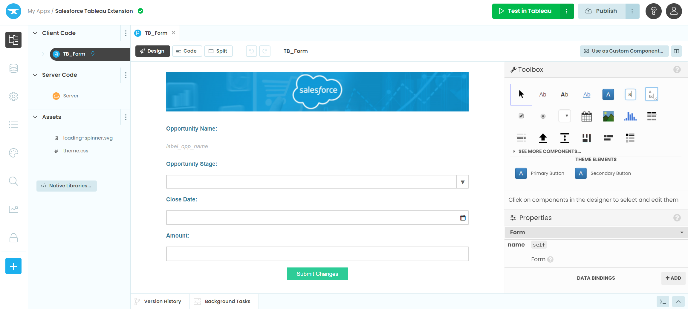

Press the green button in the top right of your screen Test in Tableau.

Follow the instructions on the pop-up.

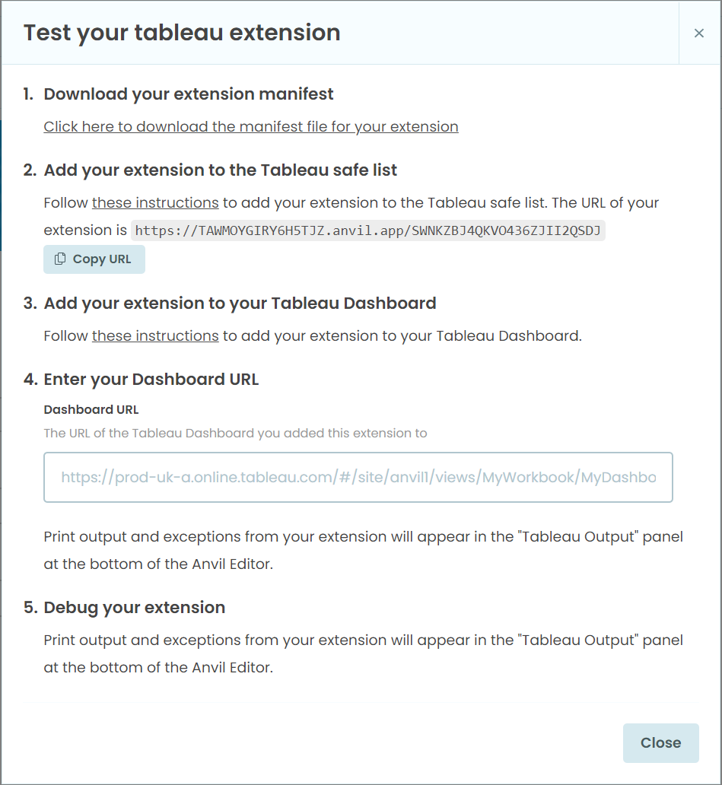

1. Download you Extension Manifest

    - First step is easy, select the click here line in section 1. You will download a file with the name of you application with a ``.trex`` file type.

2. Add your Extension to the Tableau Safe List

We're now ready to dive into Tableau!

Open your desktop version of Tableau and prepare a dashboard to display the Salesforce Opportunities. We opted to use a quilt for this example.
Connecting Tableau to Salesforce

Add Extension to Safe List

`Tableau Documentation for Adding Extensions to the Safe List <https://help.tableau.com/current/online/en-us/dashboard_extensions_server.htm#add-extensions-to-the-safe-list-and-configure-user-prompts>`_

3. Add you Extension to your Tableau Dashboard

`Tableau Documentation for adding an Extension to a Dashboard <https://help.tableau.com/current/pro/desktop/en-us/dashboard_extensions.htm#add-an-extension-to-a-dashboard>`_

4. Enter your Dashboard URL

Chapter 8: Update some Opportunities!
~~~~~~~~~~~~~~~~~~~~~~~~~~~~~~~~~~~~~~
