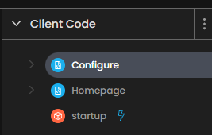
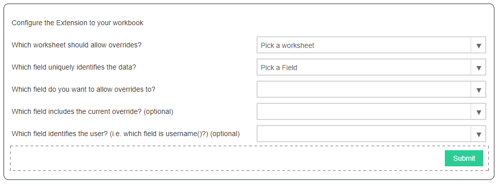
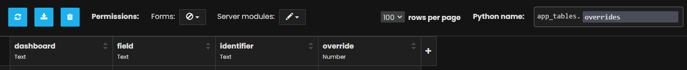
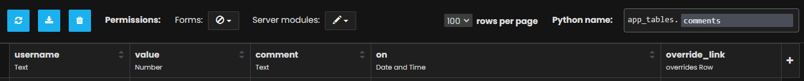

Value Override
==============

This intermediate tutorial builds off of the skills learned in the Chat Extension. If you haven't yet completed that tutorial, click here TODO

.. admonition:: Learning objectives

    * Getting selected marks from a Tableau dashboard
    * Configuring settings for your workbook
    * Opening pop up window using ``dialogs``
    * Connecting a Tableau Dashboard to an Anvil data table

We'll be building an extension that will extend further than the chat extension. While the chat extension allowed users to comment on marks, the value override extension will allow users to override the values (and leave a comment). Once' we're done, we'll have something like this:

TODO insert image

Our extension will be able to be easily configured to a worksheet and field selected using the extension, rather than being hardcoded in our Extension code.

Initial setup
-------------

* First you'll add your dependency ``Tableau Extension (Service-Based)``.
* Open this dashboard here TODO insert download link to dashboard and drop your extension into it

Add our forms
-------------

Let's create the following:

* ``Homepage`` (form): The main page for our extension
* ``Configure`` (form): The configuration page for our extension
* ``startup`` (module set as the startup form): This is where we'll launch our extension from.

Once you're done, the "Client code" pane should look like this:

Configure the startup form
--------------------------

It's a good idea to set some default values for settings. Settings are persisted in the workbook, meaning that even if someone closes the workbook and reopens it, the settings will persist. We'll be using the settings as a way to configure which sheets and which fields we want to override.

Add the following code to your startup module:

.. code-block:: python

    # "startup" module
    from tableau_extension import api, dialogs

    from .Configure import Configure

    api.get_dashboard().settings.setdefaults({
      "worksheet": None,
      "field": None,
      "field_overridden": None,
      "field_current_override": None,
      "username": None,
    })

    dialogs.open_start_form('Homepage')

As you can see, we use ``api.get_dashboard`` to get settings, and we set them all to None by default. Also something new is the ``dialogs.open_start_form``. As we'll see later, opening our start form (Homepage) this way will allow us to create popup pages that open outside the box the extension is inside.

Set up the homepage
-------------------

Go to the ``Homepage`` form and add a button to the page called ``btn_configure``. Double click it to create the event handler method ``btn_configure_click``.

We want this button to open up our ``Configure`` form when it's clicked. We could use ``anvil.alert`` for this, however, opening alerts like that confines them to the space that the extension has in the dashboard. Example below:

TODO insert example image

Instead, we can use the ``dialogs.show_form`` function from |ProductName| to open a form in a separate window. Add the following code to ``Homepage``, inside the Homepage class:

.. code-block:: python

    # Code snippet for the "Homepage" form
    def btn_configure_click(self, **event_args):
        """ When the configure button is clicked, open the dialogue box (the Configure form) """
        dialogs.show_form('configure_form', width=900, height=900)
        session.username = self.dashboard.settings['username']
        self.refresh_data_bindings()

``dialogs.show_form`` takes a string as an argument, and opens that form in a new window. Right now this won't work! First we need to register the ``Configure`` form with ``dialogs.show_form``.

Configure the ``Configure`` page
--------------------------------

Open the "Configure" form and add the following import to the top:

.. code-block:: python

    from tableau_extension import dialogs

And now we'll register the ``Configure`` form with ``dialogs``. Add the following decorator to the ``Configure`` class:

.. code-block:: python

    # Entirety of the Configure form code
    from ._anvil_designer import ConfigureTemplate
    from anvil import *
    from anvil import tableau

    from tableau_extension import dialogs

    @dialogs.dialog_form('configure_form')
    class Configure(ConfigureTemplate):
      def __init__(self, **properties):
        self.init_components(**properties)

.. admonition:: Check if it works

    Now go to Tableau and click the "Configure" button on your extension. You should see a blank window appear as a popup:

    .. image:: media/blankpopup.PNG

    Great! In the next section we'll use the Configure form to set our dashboard settings.

Add UI elements to the Configure form
-------------------------------------

We'll need to bind some of our UI components to teh dashboard settings, so first open the Code for ``Configure`` and assign the dashboard to ``self.dashboard``

.. code-block:: python

    # Full code for the Configure form
    from ._anvil_designer import ConfigureTemplate
    from anvil import *
    from anvil import tableau

    from tableau_extension import api
    from tableau_extension import dialogs

    @dialogs.dialog_form('configure_form')
    class Configure(ConfigureTemplate):
      def __init__(self, **properties):
        self.dashboard = api.get_dashboard()
        self.init_components(**properties)

Then, open up the design view for the "Configure" form and add the following elements:

* ``Label`` that says "Configure the extension to your workbook", or any other descriptive text you'd like
* ``DropDown``: ``drop_down_sheet``,

    * bind ``selected_value`` to ``self.dashboard.settings['worksheet']``

    * bind ``click`` to ``self.drop_down_sheet_change``

* ``DropDown``: ``drop_down_field``, bind ``selected_value`` to ``self.dashboard.settings['field']``
* ``DropDown``: ``drop_down_field_overridden``, bind ``selected_value`` to ``self.dashboard.settings['field_overridden']``
* ``DropDown``: ``drop_down_current_override``, bind ``selected_value`` to ``self.dashboard.settings['field_current_override']``
* ``DropDown``: ``drop_down_username``, bind ``selected_value`` to ``self.dashboard.settings['username']``
* ``Button``: ``btn_submit``, click event bound to the ``btn_submit_click`` method

Be sure to enable write-back, and select "include placeholder" for the drop down data bindings.

Feel free to add descriptive labels next to each drop down. Once you're done the ``Configure`` form should look like this:

Switch over to the "Code" panel of the ``Configure`` form.  Let's create a method called ``show_fields`` that will initialize all the drop downs using information on the dashboard.

.. code-block:: python

    # Full code for the "Configure" form
    from ._anvil_designer import ConfigureTemplate
    from anvil import *
    from anvil import tableau

    from tableau_extension import api
    from tableau_extension import dialogs

    @dialogs.dialog_form('configure_form')
    class Configure(ConfigureTemplate):
      def __init__(self, **properties):
        self.dashboard = api.get_dashboard()
        self.show_fields()
        self.init_components(**properties)

      def show_fields(self):
        self.drop_down_sheet.items = [ws.name for ws in self.dashboard.worksheets]

        fields = []
        if self.dashboard.settings['worksheet']:
          ws = self.dashboard.get_worksheet(self.dashboard.settings['worksheet'])
          records = ws.get_summary_records()
          if not records:
            ph = "No summary fields in worksheet!"
          else:
            ph = "Pick a field"
            fields = [f for f in records[0]]
        else:
          ph = "Pick a worksheet first"

        for dropdown in [
          self.drop_down_field,
          self.drop_down_field_overridden,
          self.drop_down_current_override,
          self.drop_down_username,
        ]:
          dropdown.placeholder = ph
          dropdown.items = fields

      def btn_submit_click(self, **event_args):
        pass

      def drop_down_sheet_change(self, **event_args):
        self.show_fields()

As you can see, we use the ``get_worksheet`` and ``get_summary_records`` methods to get info out of the dashboard. We can access our dashboard settings like a dict, that is, we can write code like ``settings['myvalue']`` to get the value of ``myvalue``.

.. admonition:: Check if it works

    To prove this, open the configure page and make selections for each of the drop downs. Then, restart your extension. You should see your selections still there!

Set settings in the Configure Form
----------------------------------

Now that we can open our configure form, let's allow the user to set the settings from this page.

.. important:: Dashboard settings are persisted in the workbook

    Our dashboard has settings we can configure that are saved even when someone closes and reopens the workbook. We can use them to persist data, such as workbook or dashboard configuration.

Set up your database tables:
----------------------------

We'll need 2 tables, one called ``overrides`` that holds the latest override value, as well as a table named ``comments`` that will store all the comments and changes to the overrides someone has made.

The ``overrides`` table

* dashboard (Text)
* field (Text)
* identifier (Text)
* override (Number)

The ``comments`` table

* username (text)
* value (number)
* comment (text)
* on (Date and Time)
* override_link (Single link to a row in the overrides table)

