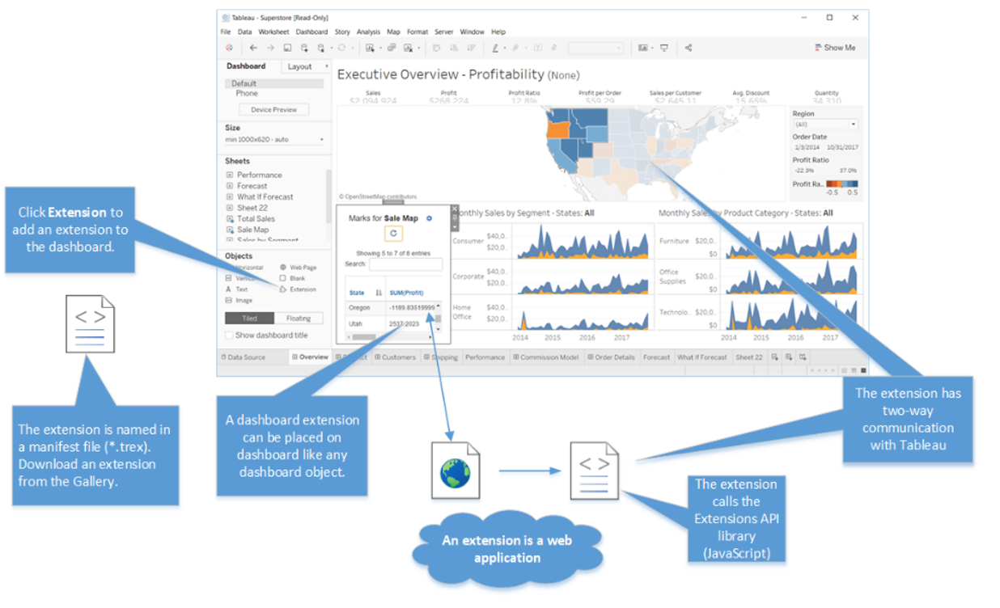
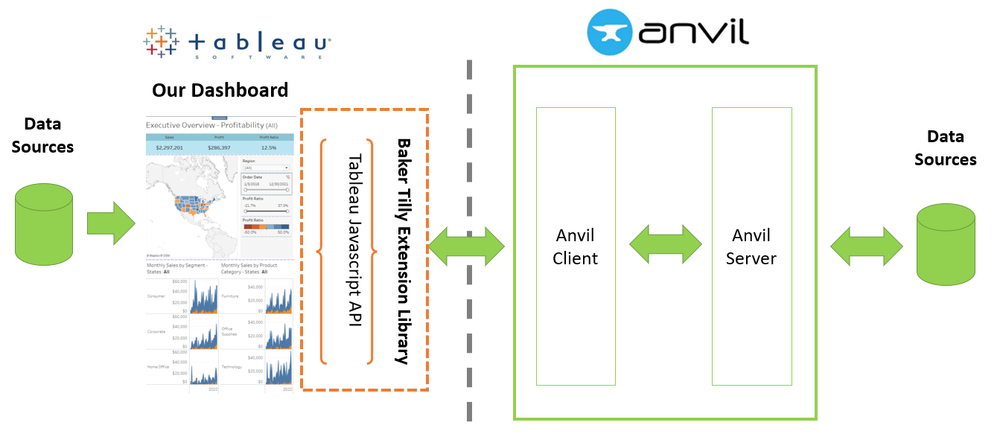

Tableau Extension Overview
------

This is a python library that allows users to create Tableau extensions with Anvil using only Python. 

:octicon:`question` What's Anvil?
=======

Anvil is a Python-based, full stack web framework used to rapidly develop and deploy web applications. 

:octicon:`question` What's a Tableau extension?
=======

In Tableau's own words, 

    "The Extension API enables customer to integrate and interact with data from other applications directly in Tableau"

.. raw:: html

    <h4>...in other words</h4>

Tableau dashboard extensions are web applications that have two-way communication with the dashboard. They enable all sorts of scenarios, like letting you integrate Tableau with custom applications, making possible for you to modify the data for a viz, or even creating custom visualizations inside the dashboard. 

:octicon:`checklist` The 3 main components of a dashboard extension
=======

Every Tableau extension has 3 things:

- **TREX file:** A Tableau extension consists of a single manifest file (.trex)

- **Web Page:** A web page that uses a Tableau-provided JavaScript library

  - This is the html / css / js that controls what the extension looks like

- **Extension Logic:** The JavaScript file (or files) that contain your extension logic

  - This is the JS that controls how the extension interacts with the dashboard

:octicon:`question` What can you do with an extension?
=======

Because Tableau extensions are web applications, there is a wide variety of different things you can do with them. Things like:

* Integrate with third-party APIs inside the dashboard
* Use third-party charting libraries like ``visjs`` or ``d3`` to add custom visualizations
* Enable write-back functionality so users can modify data in a viz and have that change automatically update the source data 
* Build custom viz and interactivity types, such as a filter replacement and custom interfaces
  
To get a taste of what other people have built, check out some `dashboard extensions on the Tableau Exchange <https://exchange.tableau.com/extensions>`_

:octicon:`file-diff` Extension API vs. Embedding JavaScript API
=======

.. potentially move this to the FAQs

Related, but separate from the Extensions API is the Embedding JavaScript API.

While the Extension API puts web applications into a tableau dashboard, the Embedding Javascript API puts tableau dashboards into a web application.

* You can use the Embedding JavaScript API for embedding Tableau dashboards in web pages (for example, blog posts), or in line of business applications.
* You can use the Extensions API for integrating web applications into zones in Tableau dashboards.
  
The python documentation you are currently reading is related to the Extensions API and **not** the Embedding Javascript API.

:octicon:`alert` Challenges with Extension Development
=======

While the Tableau extension JS API is powerful, extension development has challenges. For data teams with Tableau and Python experience,

* There is a significant learning curve to get started
* Extensions require a significant amount of technical knowledge and supporting tools to operate. This includes networking, dev ops, JS programing, security, etc.
* During several attended in-person trainings from Tableau, it's rare for developers to make it through the tutorial and many gave up along the way
* Lots of effort is required to stand up a development environment (chrome headless / npm / sdks)

:octicon:`credit-card` :octicon:`arrow-right` :octicon:`light-bulb` This Library's Objective: Investment to Insight
=======

The primary purpose of this Python library is to reduce the amount of time required to go from investment to insight

.. important::

    By making Tableau Extensions more accessible to organizations, Dashboard Developers are unleashed to do more. "More" includes new integrations, sophisticated user interfaces, and more advanced data tools.
    
This Python library accomplishes this by:

- Creating a Pythonic representation of the Tableau Dashboard
- Enabling one-Click extension deployment
- A modern, efficient development experience
- Enterprise-ready user management and access controls
- Transparent, real-time logging and error handling
- Secure Server environment

The below image outlines how this Python library is related to Anvil and Tableau.
  

Now that you have a good handle on the extensions framework, head over to the :doc:`getting_started` guide for a short walkthrough of what the development experience is like.
